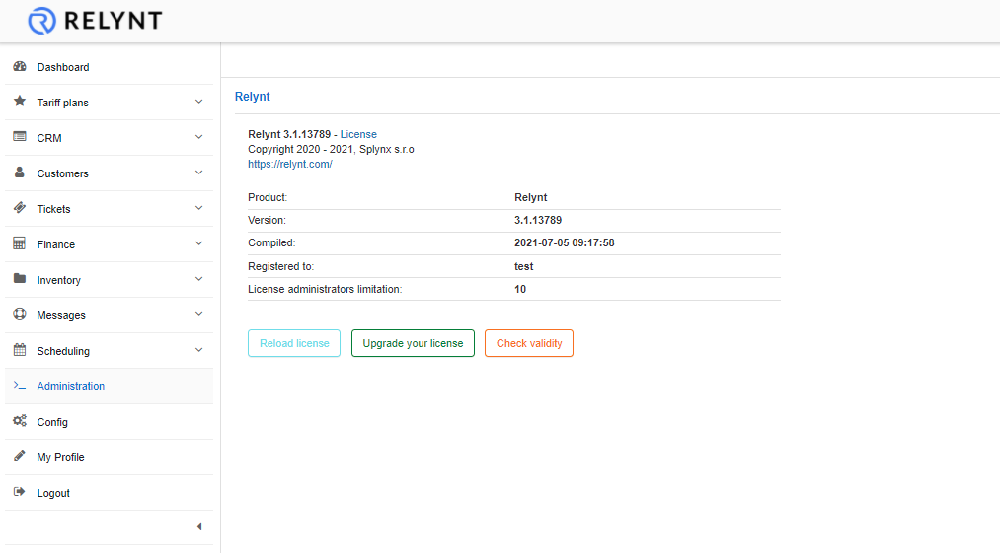
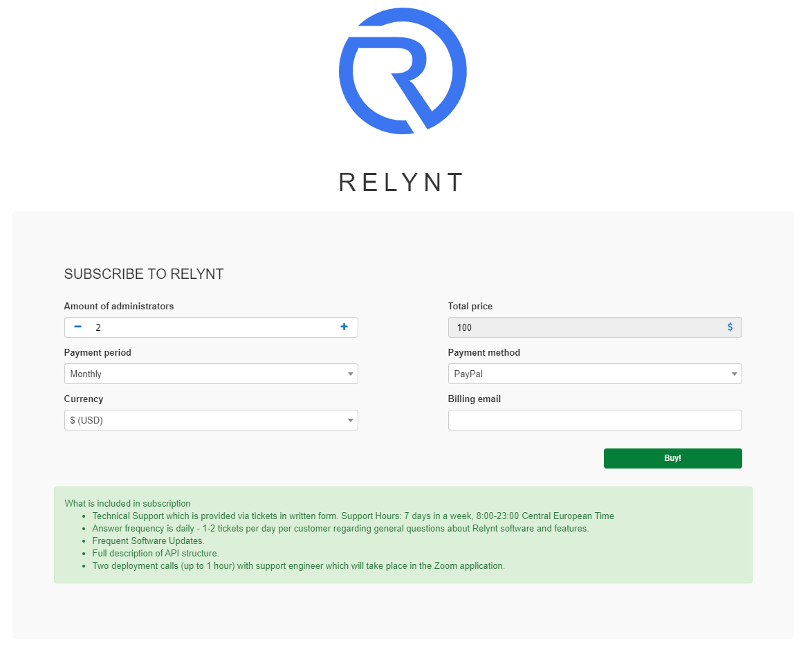
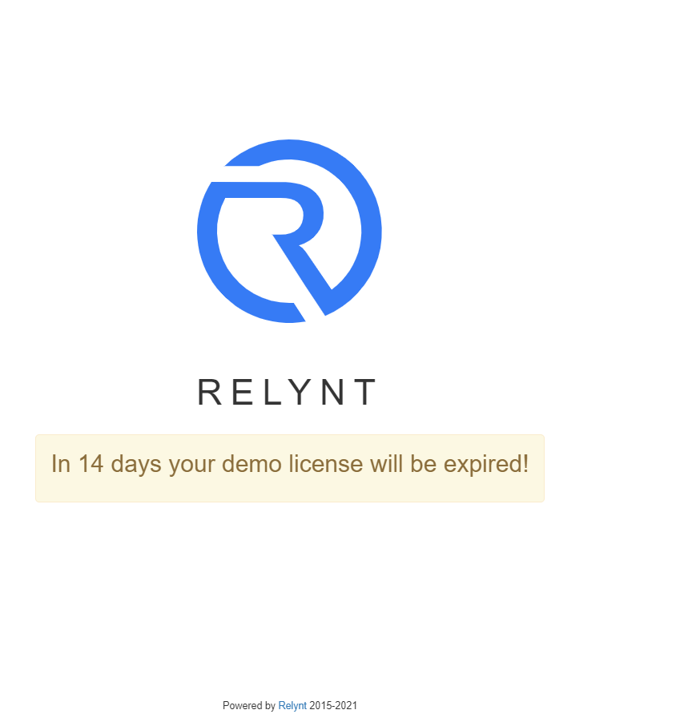

License
==============

This sections provides useful information on the license of your Relynt server.

Your Relynt server version can be found here and the status of your license with regards to its limitations.

**Product**:	This displays the name of the software being Relynt

**Version**:	This displays which version of Relynt your server is currently running on

**Compiled**:	This displays when the software version was compiled on the server

**Registered to**:	This displays the company the software license is registered to

**License administrators limitation**:	This displays the limitations to the number of administrators you can add to the system, relevant to your license.

Along with this information is also a few functions provided.

1. **Reload license** - this button can be used to reload your Relynt license, typically after migrating, upgrading, etc.

2. **Upgrade your license** - this button will redirect you to the Relynt subscription page where you can purchase additional licensing for your server.

3. **Check validity** - this button will redirect you to a Relynt subscription page where it will display the validity/expiry date of your license:

