Pending statuses & services
======================

The pending statuses & services logs tables shows the list of statuses or plans with forthcoming changes.  It could be, for example, when customer's status is set to be changed on a particular day or a new service will be activated on a specific day.

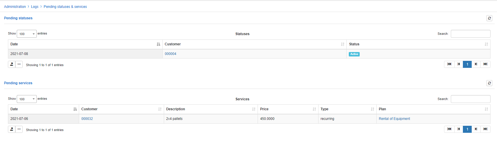

*Pending statuses* - this section displays the date of change, customer's ID and status (new, activate, blocked, inactive). To view a Customer's information you can simply click on the customer's ID in the table.

*Pending services* - this section displays the date of change, description of the service, it's price, type and plan. To view the Service plan information you can simply click on the name of the plan in the *Plan's* column of the table.

1. **How to set up pending change of status**

To set up a pending change of status for a customer click on the *Calendar* icon next to the *Status* <icon class="image-icon"></icon> in the *Customer's Information* window. You can then set the date when the status will be changed and choose the desired status to change to and save changes.

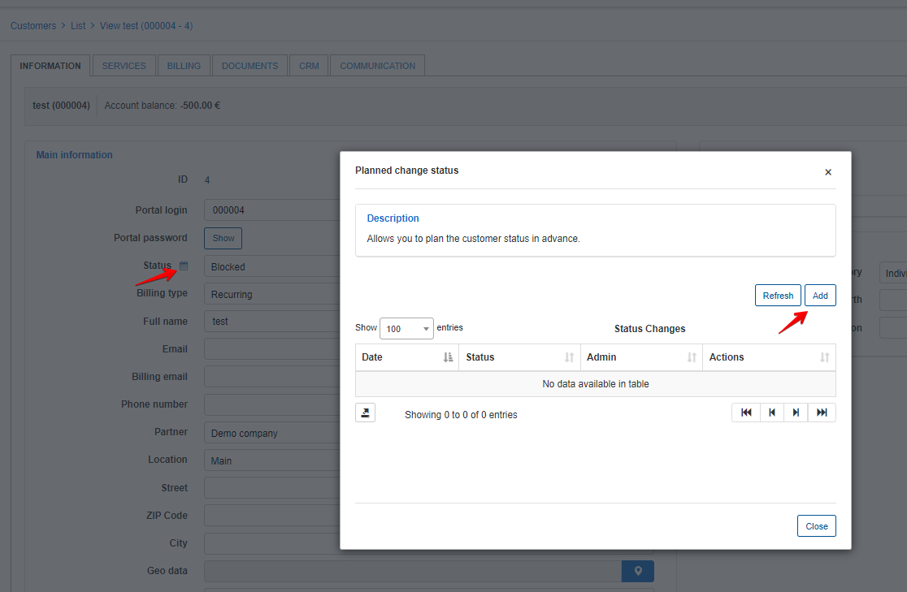

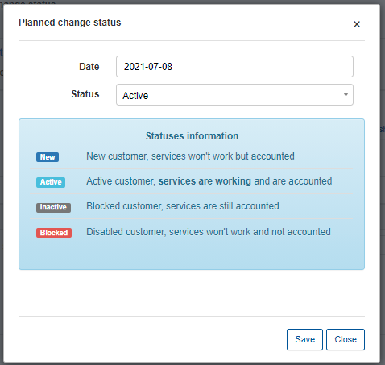

After changes are applied, the *Calendar* icon next to the *Status* will change in colour <icon class="image-icon"> </icon>. You can view the pending status in *Administration → Logs → Pending statuses\plans* or directly from the _Customer information_ page by click on the _Calendar_ icon.

Administration:

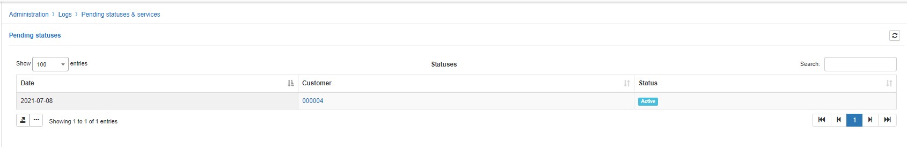

Customer:

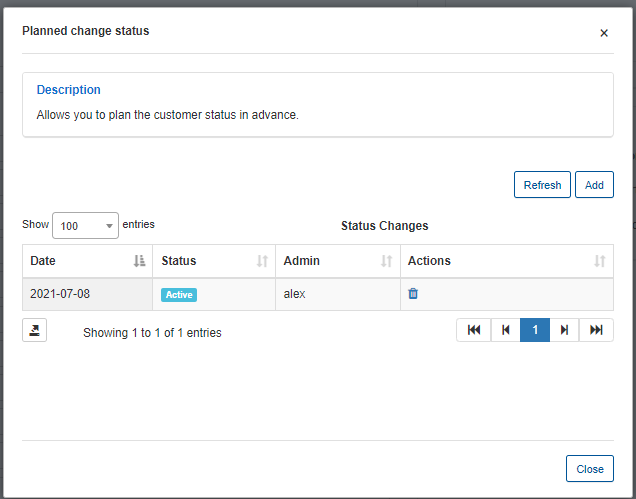

2. **How to set up pending change of service**

To set up a pending change of a service, navigate to *Customers → Select/View → Services*, select a service you'd like to change, and click on the edit planned <icon class="image-icon"></icon> icon in the actions column.

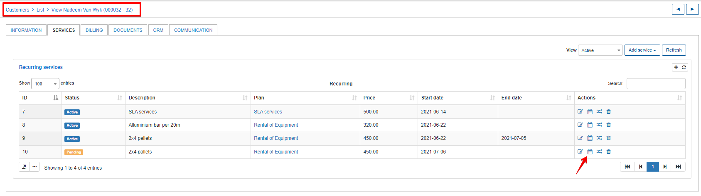

You will be presented with an _Edit service_ window to firstly, select the _Planned date_ and then the parameters to change (Quantity, Unit, Price, Dates, Status)

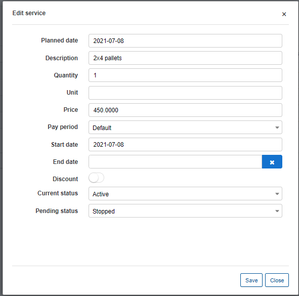

After service has been added it will be possible to check it in in *Administration → Logs → Pending statuses/plans (if starts date differs from today's date and it has pending status)*.

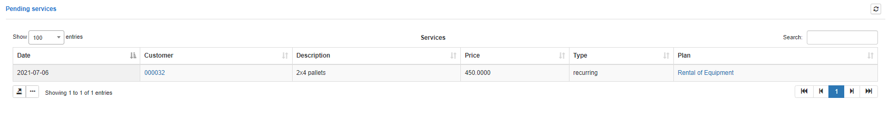

You will also see details of Change plans if any has been applied.

**Applying a change of plan**

Navigate to _Customers / Select/View / Services_ and click on the change plan <icon class="image-icon"></icon> icon in the Actions column:

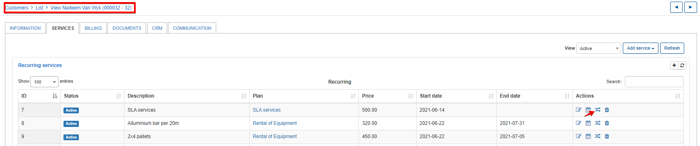

You will be presented with the window to select the new start date and the plan to change to, this will automatically display the new service details and processing info:

 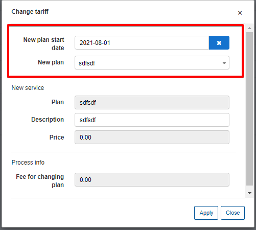

 Upon clicking apply a new service will appear with a pending status and you will be able to view this details in _Administration → Logs → Pending statuses/plans (if starts date differs from today's date and it has pending status)_

 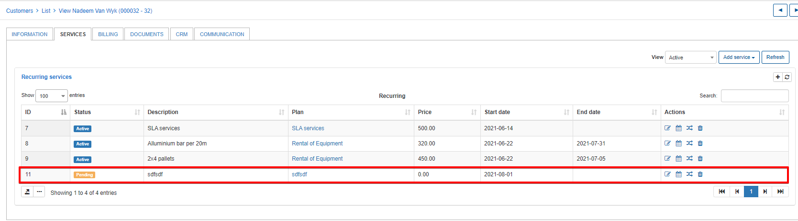

 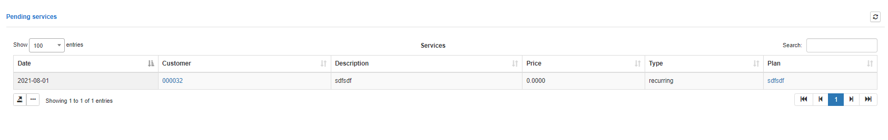
