Admins and permissions
======================

The administrators section displays a full list of all administrators created on Relynt with derails like admin login's, full names, roles, phone numbers and other information relevant to the administrator, filtered by the Partner selected:

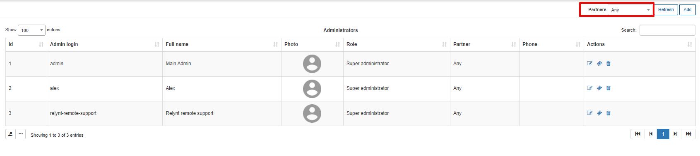

You can export via print, copy or saving the list of admins in PDF and/or CSV file formats by clicking on the export <icon class="image-icon"></icon> icon below the table. It is also possible to select the columns to be displayed in the table by clicking on the breadcrumbs <icon class="image-icon"></icon> icon below the table.

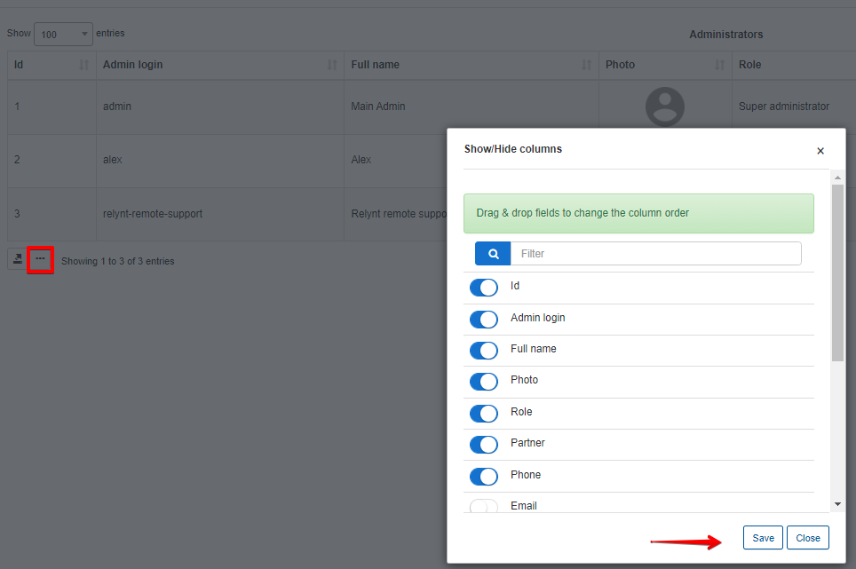

**_P.S - The amount of administrators you can create is limited to your License!_**

#### Adding an administrator
To add a new administrator, first select the Partner in the and click on the *Add icon* in the top right corner of the page, a window will appear for you to specify the following details of the administrator:

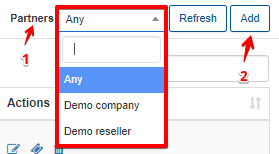

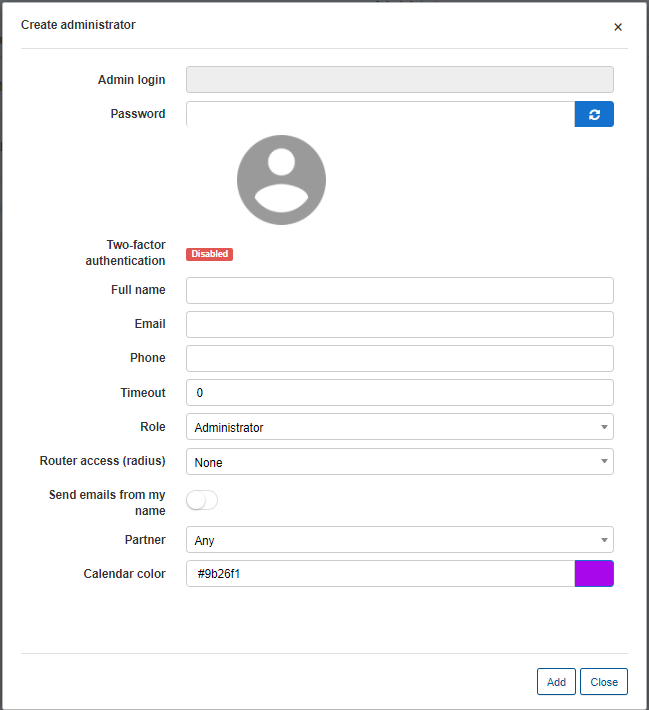

* **Admin login** - type the login of the administrator

* **Password** - type or generate the password of the administrator

* **Two-factor authentication** - Shows whether two factor authentication is enabled/disabled for the administrator. (Can be configured under [My Profile](my_profile/my_profile.md))  

* **Full name** - specify the full name of the administrator

* **Email** - specify the email address of the administrator

* **Phone** - specify the phone number of the administrator

* **Timeout** - specify the timeout interval for login sessions in seconds

* **Role** - assign a role to the administrator which will apply a preset scheme of permissions for the admin: Administrator, Customer Creator, Financial Manager, Manager, Super Administrator or a custom role you have created

* **Send emails from my name** - enables/disables sending of emails from the administrators email, overrides system email configuration.

* **Partner** - select a partner to associate the administrator with, this is the way to limit the access to information for admins in Relynt by selecting only one partner, so the administrator will only be able to operate with all information associated with one particular partner. Simply select one partner or the option *Any* to give the admin access to all the partners and their information on the system.

* **Calendar color** - select a color for the administrators icon on Calendars within the Scheduling module.

#### Editing an administrator

To edit and administrators details, click on the *edit icon* <icon class="image-icon"></icon> in the Actions column of the table. The edit window will appear, where you can make the desired changes to their details.

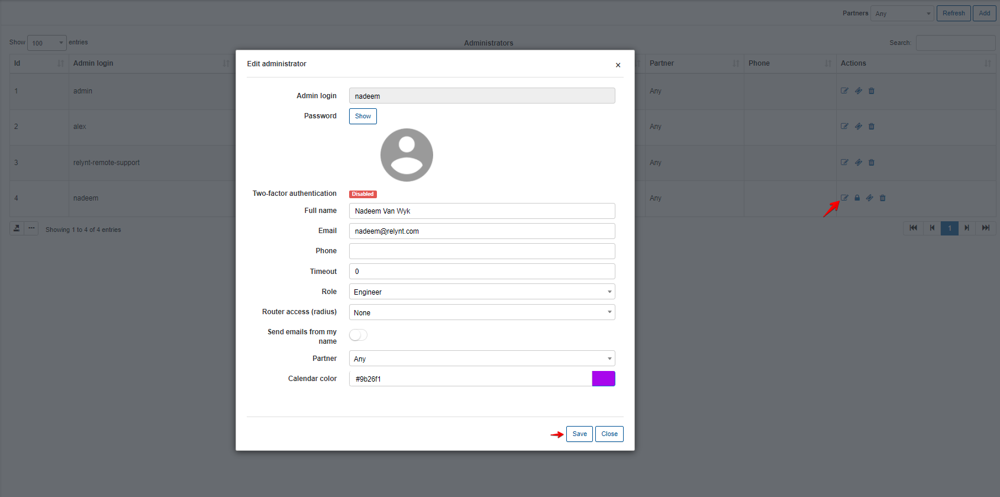

#### Changing permissions for the new administrator
To change the permissions of an administrator, click on the permissions icon <icon class="image-icon"></icon> in Actions column. The window will appear, where you will be able to check and change all administrator's permissions.

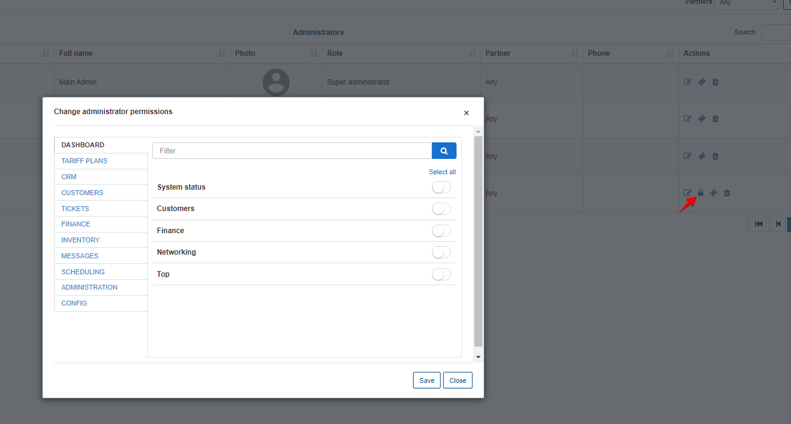

Main fields available for changes :

* **Dashboard**

* **CRM**

* **Tariff plans**

* **Customers**

* **Tickets**

* **Finance**

* **Inventory**

* **Messages**

* **Scheduling**

* **Administration**

* **Config**

By clicking on each field you can change the particular permissions for different subcategories of that field.

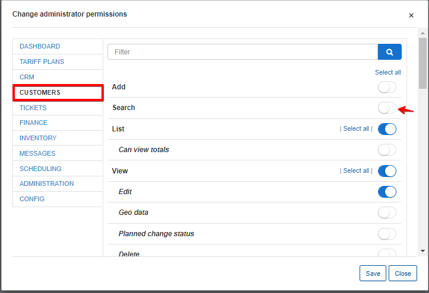

#### Helpdesk

By clicking on the helpdesk icon <icon class="image-icon"></icon> in the *Actions* column of the table, we can change the scope of the administrators access to tickets.

The feature allows you to restrict administrators to only view/interact with tickets you wish to grant them access to. This feature only restricts the administrator's access to tickets by your selection of scope, it does not change any permissions you have granted to the administrator, it only narrows or broadens the scope of ticket the admin will have access to with the same permissions you have granted the admin via the role assigned or the custom permissions you have selected for the admin.

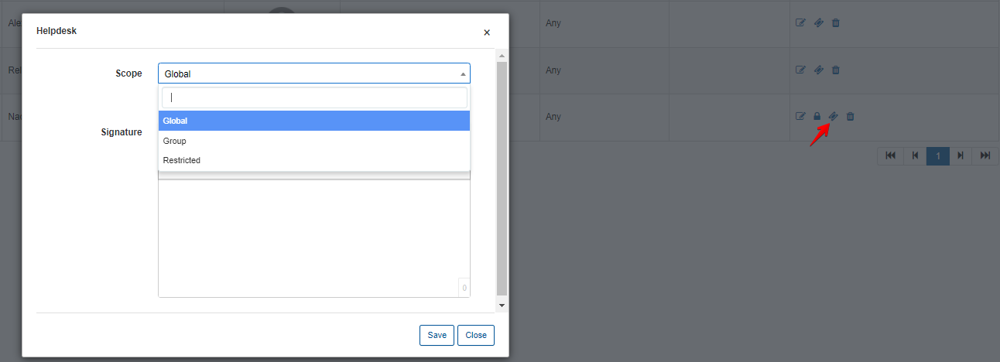

There are 3 scopes you can assign an administrator to:

* **Global** - selecting this option will give the administrator access to all tickets on the system.
* **Group** - selecting this option will limit the administrator to a specific group which you will have to specify upon clicking this option.

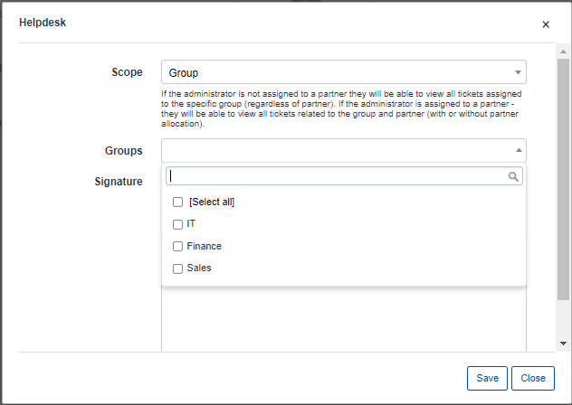

* **Restricted** - restricts the administrators access to the tickets which are assigned to them.

**N.B!!!** The Helpdesk **Scope** is directly impacted by the configuration of **Ticket Groups** and vice versa.

i.e - If the admin's scope is selected as Global, the admin will not be available to select within the ticket group agents. If you have select groups within the scope, your first selection to assign the admin to a group will automatically change the scope to the specific group you have assigned the agent to.

#### Deleting an administrator
To remove an administrator account from the system, click on the trash <icon class="image-icon"></icon> icon in the Actions' column.

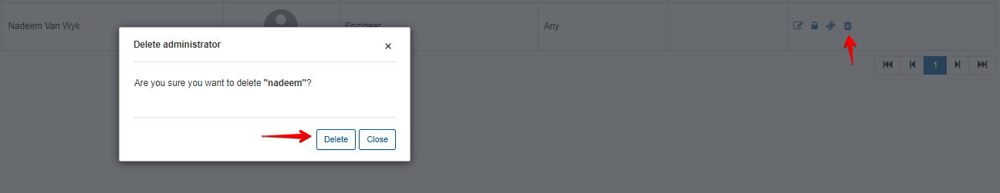

It is possible **to view all the operations executed by each Administrator** by navigating to *Administration → Logs → Operations*. If you click on the details <icon class="image-icon"></icon> icon in Actions column of the table you will be able to see details of each operation:

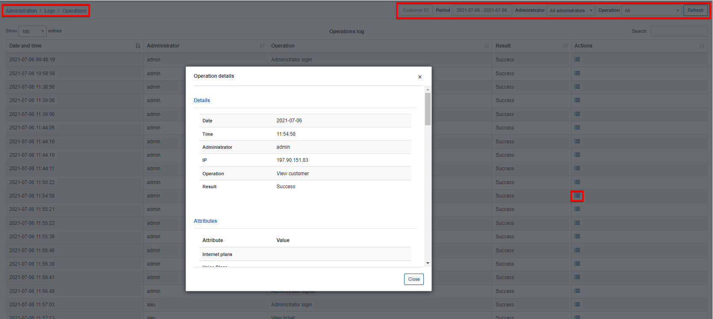
