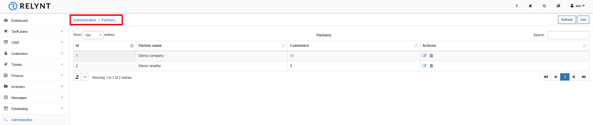
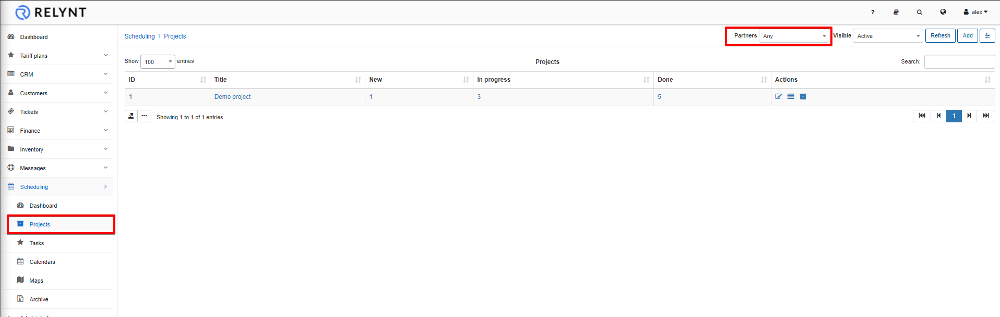

Partners
========

A partner in Relynt is basically a service provider or any sub-provider of your services. This feature can also be used to simply separate the data on the system for branch purpose/or any other reason, and it can be used in a subcontracting environment.

The partners table shows a list of all Partners on the system with number of customers assigned to it.  If you click on each number in the Customers' column, the full list of customers associated with the Partner appear.

**Another way to filter or search** customers who belong to the same Partner is by selecting the relevant partner in the *Partner* field of the  *Customers → Search* tool.

You can **add a new partner** by clicking on *Add* in the top right corner of the page.

You will specify the name of the Partner and which sections of the system to add the partner to.

You can also **edit the partner** by clicking on *Edit icon* <icon class="image-icon"></icon> in the Actions column. You can then change the name and sections of availability of the partner:

Here are a few more tips on the configuration of Partners:

1. **All the data entries of each feature added to the system can be assigned to a specific partner.**

When you click on *Tariff plans → Recurring* a full list of Recurring Tariff Plans will appear, where you can filter the table by a Partner.

If you'd like to change or add a partner to the particular Tariff Plan you have to click on it in thw *Title* column or click on icon *Edit* <icon class="image-icon"></icon> in the Actions column.:

The same logic can be applied to **Scheduling** as an example:

2. **You can limit the access to information for admins in Relynt by selecting only one partner in their profile settings**

Administrators will be able to operate with all information associated with one particular partner if you associate them with only one specific partner. You can find this option in *Administration → Administrators*. Click on the edit <icon class="image-icon"></icon> icon in the Actions column and window will appear, where it will be possible to select one partner or the option *Any*.

3. **You can configure different company information and other parameters in `Config`, where the `Partners` field is available.**

For example, in a subcontracting environment, it is possible to set up different company information as well as a percentage of commission for partners for each payment made by customers for partners services in *Config → System → Company Information*.

Simply select the desired Partner to work with and fill in the details as required, the *Partner percent field* will be available to specify the percentage for the Partner's commission.

After the commission has been set up, you will be able to check the amount paid to the partner in *Finance → Invoices*. At the top side of the window choose an appropriate *Partner* (with Period of time and Payment Status, if necessary) and below the list of Invoices you will see the "*Totals*" table, displaying total amount paid and amount of commission for the partner.

Anywhere in the Config of the system where the **Partners** field is available for selection, means that you can specify a different configuration for each of the partners on the system:

