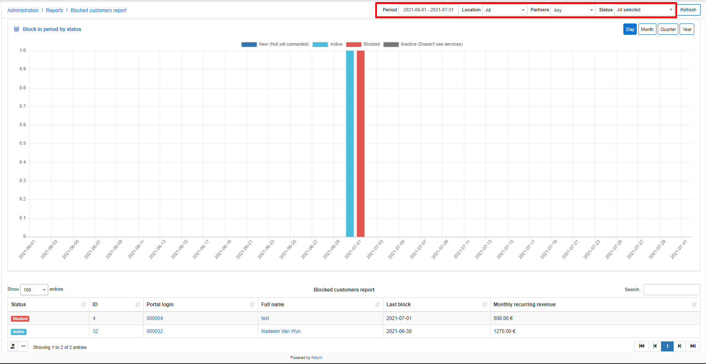
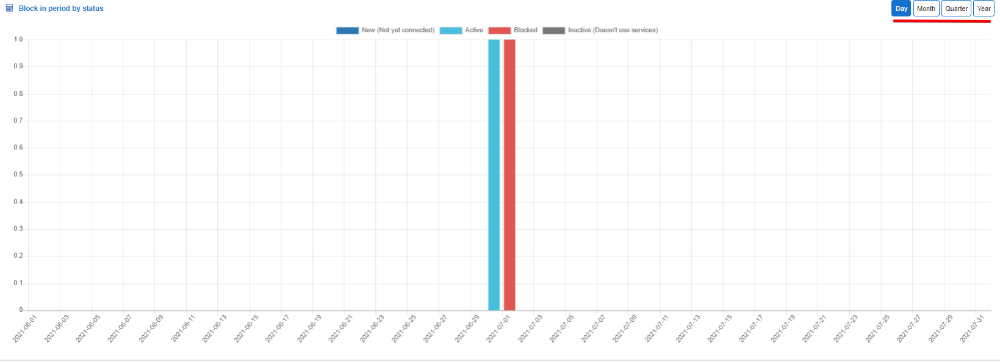
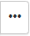
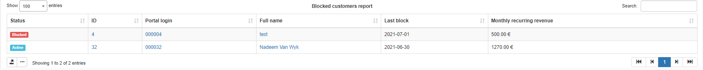
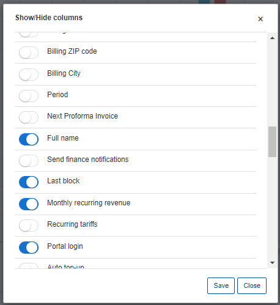

Blocked Customers Report
=======

In this section, we can view reports of customers who have been blocked by the system and status changes of customers who were blocked and changed within the period specified and relative to the criteria in the filter.

The first part of the report is presented on a graph displaying the amount of customers in their different status, relevant to the change from being block, for the time period select in the filter. The graph can be changed to display data daily, monthly, quarterly or annually.

The second part of the report is presented in a table format displaying data relevant to the criteria selected in the filter. The table can be exported or modified to display specific data with the icons provided below the results

When using the export button, you will be presented with the following option as methods to export the table:

Simply click on the desired method and a download will begin.

When using the modify button, you will be presented with the following window:

In this window, you can simply enable or disable each field according to your preference with the toggles provided, and you can drag and drop the field to order it in a layout of your choice.
