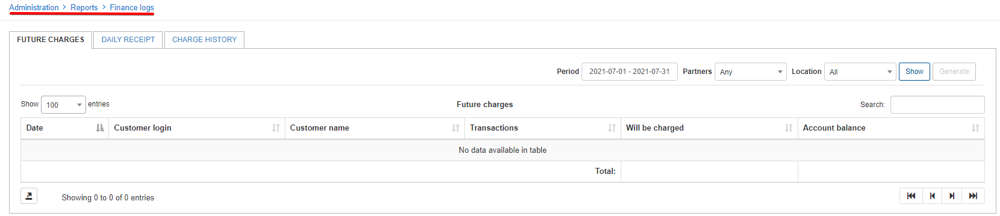

Finance logs
=====================

In this section we can show and generate reports on finances in relation to billing on the system.

Finance logs is separated into 3 sections

**Future charges** 
**Daily receipt** 
**Charge History**

Each section has a filter of which you can specify the parameters of the data you wish to display on the table. Once results are shown in the table based on the selected criteria, it is then possible to Generate, Download or simply Export the table with the buttons or icon provided on each page.

Please follow the links below for more information on each:

 * [Future charges](administration/reports/finance_logs/future_charges/future_charges.md)

 * [Charge history](administration/reports/finance_logs/charge_history/charge_history.md)

 * [Daily receipt](administration/reports/finance_logs/daily_receipt/daily_receipt.md)
