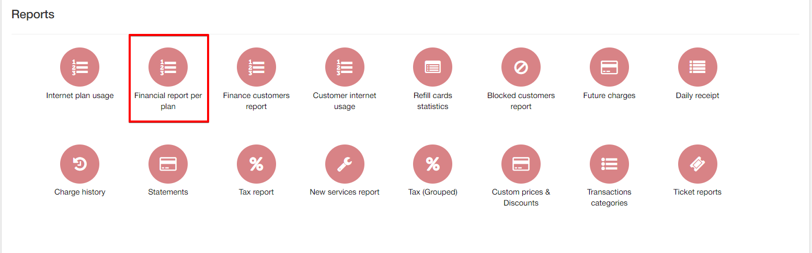
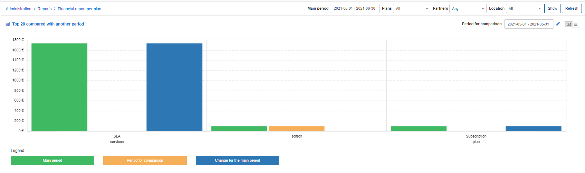
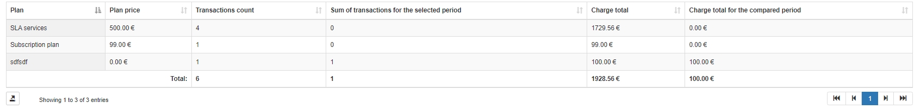

Financial report per plan
==========

This is a financial report of all tariff plans on the system. The report displays a chart of periods for the count of total number of transactions the plan created or a total amount of funds each plan has generated charges for represented by a color relevant to the legend, and can be filtered to display data of a Main period VS the period of comparison selected, which in turn displays the change of data against the main period. The report also displays data of the totals for the main period selected in a summarized table.

The report can be filtered by a specific period, plan, a particular partner, and/or location to specify the criteria of your desired data to compare the periods of data against.

The data displayed is relevant to the Main filter parameters versus the period of comparison. The period of comparison is set by default to the prior period of the main filter to generate results for the change data, however, you can specify a custom period of comparison:

The report is first presented in a graph format, which can be changed to display data by charge or by total count, as depicted below:

This data is then summarized in a table as shown below:

This table can be exported for reference purposes with the use of the export  icon located at the bottom left of the table, in a format of your choice, from the methods available.

