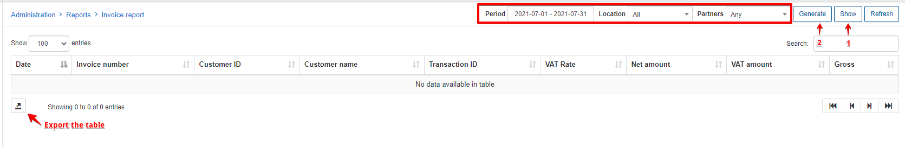
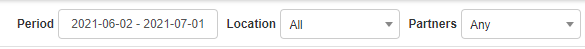
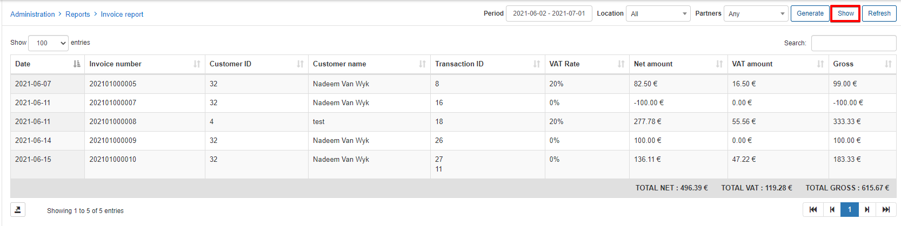
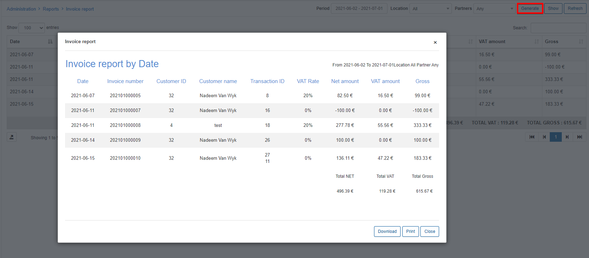
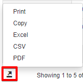

Invoice report
==========

This section allows us to generate invoice reports for all customers on the system based on the criteria that you select in the filter.

The filter allows you to select a period, location and partner relevant to invoices you wish to display. Upon selecting a criteria, simply click on **Show** to display the results, then click on **Generate** to download or print the report.

The table can also be **Exported** in a format of choice with the icon at the bottom of the table.

### Generating an Invoice report

**1.**  Specify your desired criteria in the filter:

**2.** Click on **Show** to display the results of your criteria:

**3.** Click on **Generate** to Download or Print the report:

It's that simple!

If you wish to export the report in a different format, simply use the export button located at the bottom of the table and select from the formats available:

