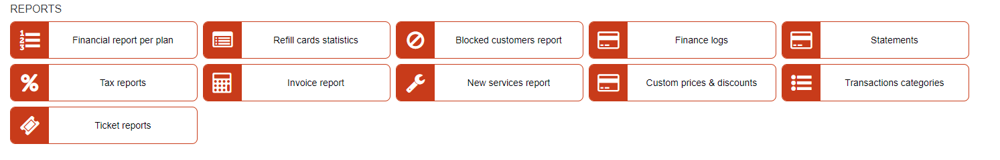

Reports
==================

In this section we can view various reports generated in the system.

* [Financial report per plan](administration/reports/financial_report_per_plan/financial_report_per_plan.md)

* [Refill cards statistics](administration/reports/refill_cards_statistics/refill_cards_statistics.md)

* [Blocked customers report](administration/reports/blocked_customers_report/blocked_customers_report.md)

* [Finance logs](administration/reports/finance_logs/finance_logs.md)

* [Statements](administration/reports/statements/statements.md)

* [Tax reports](administration/reports/tax_report/tax_report.md)

* [Invoice report](dministration/reports/invoice_report/invoice_report.md)

* [New services report](administration/reports/new_services_report/new_services_report.md)

* [Custom prices & discounts](administration/reports/custom_prices_and_discounts/custom_prices_and_discounts.md)

* [Transaction categories](administration/reports/transaction_categories/transaction_categories.md)

* [Ticket reports](administration/reports/tickets_report/tickets_report.md)
