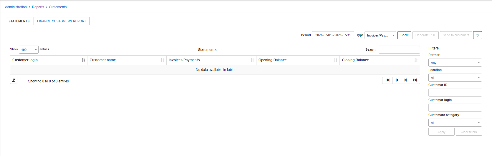
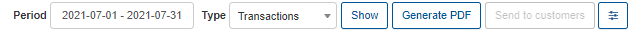
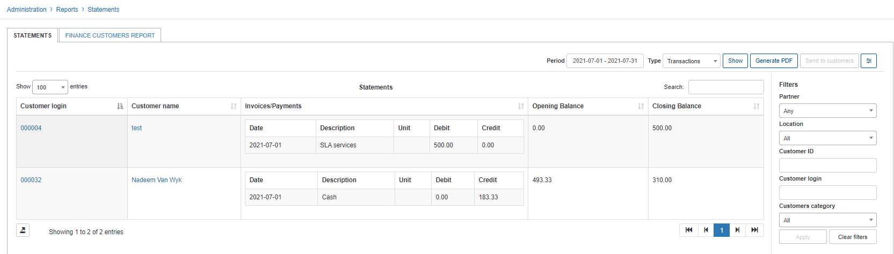
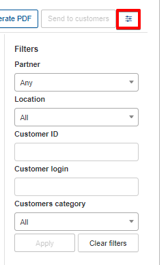
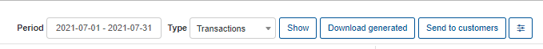
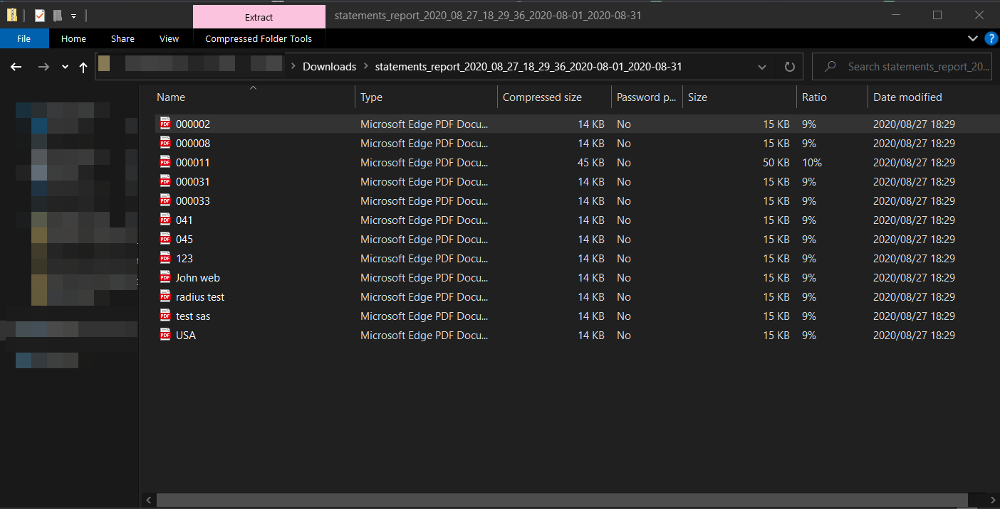
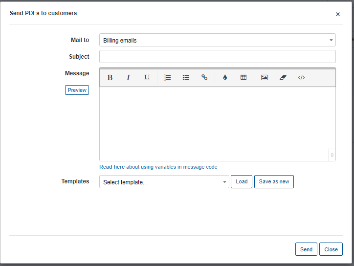
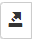
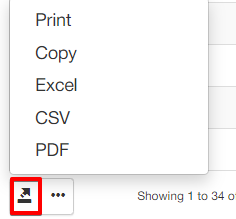
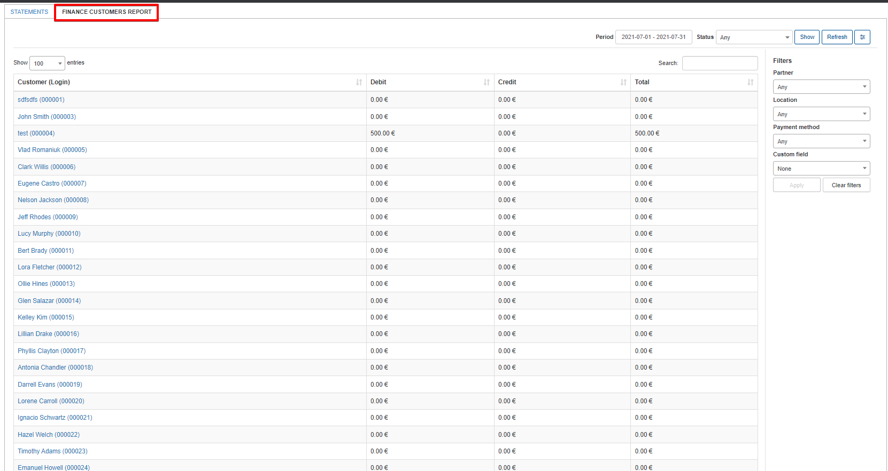

Statements
===========

In this section, we can view a report of customer financial statements specifically regarding invoices VS payments or transactions and the opening VS closing balances of customers. The report is represented in a table format and specifically displays data specified in the filter criteria. Therefore, it is necessary to specify which kind of report you wish to display, being either transactions or invoices/payments. Simply use the filter located at the top right of the table to select a period and the type of data to display, then click on show:

Upon clicking on "Show" the data will be retrieved according to your criteria:

You can further specify the data you wish to display with the use of the gear icon within the filter:

You can then filter the data to display results pertaining to a specific partner and/or location, or a specific customer, or even a customer category.

Once you have filtered the table/report to display data of your preference, you can then generate the statment by clicking on the "Generate PDF" button located within the filter.
Upon clicking this button,once the statement is ready, the Generate button will change into a "Download generated" button, which can be used to download a ZIP file containing PDF statements for each customer according to the data criteria you have specified in the filter. After generating a statement, the option to send it to the customers will also become available for you to send each customer their statements:

Clicking on download will automatically begin a download of the ZIP file.

You can then locate this zip file in your downloads folder and view each statement downloaded:

Clicking on "send to customers" will present you with the window to create the email message and parameters for sending:

**Mail to** - which emails of customer email/billing emails
**Subject** - can be typed manually or populated by the selected template
**Message** - can be typed manually or populated by the selected template
**Templates** - click on the dropdown list to select a predefined template to load or click on save as new to save the text typed in the message box as a new template.

Additionally, the actual table can also be exported in a format of your preference from the methods available with the use of the export  icon located at the bottom left of the table:

Statements also provides a Financial report for all customers, displaying the customer, the total funds of debit and credit transactions, and the total funds on the customers account.

This table can also be filtered to display data relevant to the parameters available to select and export with the export  icon at the bottom of the table
