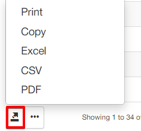

Tax report
=============

In this section, we can display a report of customers specifically presenting tax figures of transactions according to the rate and the Net and Gross amounts of each invoice.

The tax report is divided into 2 sections **Tax report** and **Tax grouped report**.

### Tax report

This report is represented in a table format which groups customers by the relevant tax rates recorded in the system. The report displays customer details, financial records like invoice and transaction ID's relevant to the VAT or tax rate and financial total details like, the rate percentage, the net amount per invoice, the rate/VAT amount and a gross total of each entry.

The table can be filtered by a specific period, partner and/or location with the use of the filtered located at the top left of the table. Once you have specified you desired criteria, you can then click on show to display the results according to your criteria, you can then use the "generate" button to download an HTML copy of the report or choose to print it:

Upon clicking on this button, you will be presented with the following window, where you can choose the action you wish to execute:

Additionally, this table can also be exported in a format of your choice of the methods available with the use of the export  icon located at the bottom left of the table:

### Tax Grouped report

This section displays a report of all taxes configured under `Config/Finance/Taxes`. The report displays a count of invoices pertaining to a specific tax, the tax rate itself, the sum of all invoice amounts pertaining to the tax and a total amount of funds that was charged for the specific tax

The report is presented in a table format and can be filtered by a specific period, partner and/or location. Simply specify the criteria to you preference in the filter located at the top right of the table and click on show to retrieve the results according to your criteria:

The table can also be exported with the export  icon located at the bottom left of the table.
