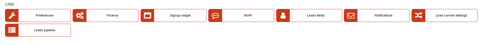

Customer relationship management(CRM)
=============

All the functionalities of the CRM module within Relynt can be configured to your preferences in this section.

All configurations of the functionalities OF the CRM like financial settings, notifications, the Signup widget and more can be customized here.

The following are the tutorials pages for each of the aspects available for configuration in the Relynt CRM module:

* [Finance](configuration/crm/finance/finance.md)

* [Leads stages](configuration/crm/leads_stages/leads_stages.md)

* [Leads convert settings](configuration/crm/lead_convert_settings/lead_convert_settings.md)

* [Leads pipeline](configuration/crm/leads_pipeline/leads_pipeline.md)

* [Notifications](configuration/crm/notifications/notifications.md)

* [Preferences](configuration/crm/preferences/preferences.md)

* [Sign Up Widget](configuration/crm/sign_up_widget/sign_up_widget.md)

* [IMAP](configuration/crm/imap/imap.md)
