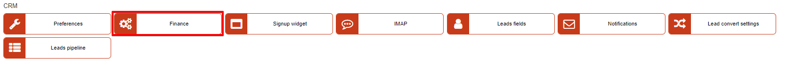
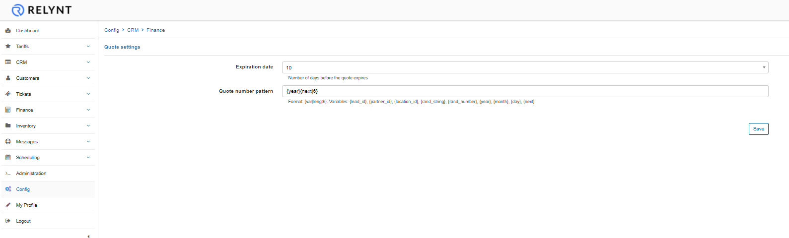

Finance
=============

In this section we can configure  basic settings for quotations created by the CRM module.

# Quote settings
* **Expiration date** - number of days before the quote expires;

* **Quote number pattern** - specify a format for quote numbers

*Format: {var|length}*

*Variables: {lead_id}, {partner_id}, {location_id}, {rand_string}, {rand_number}, {year}, {month}, {day}, {next}*
