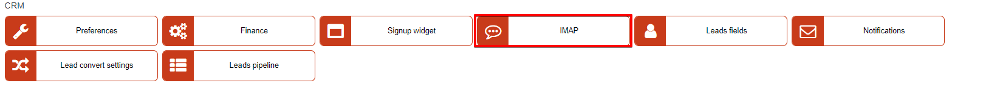
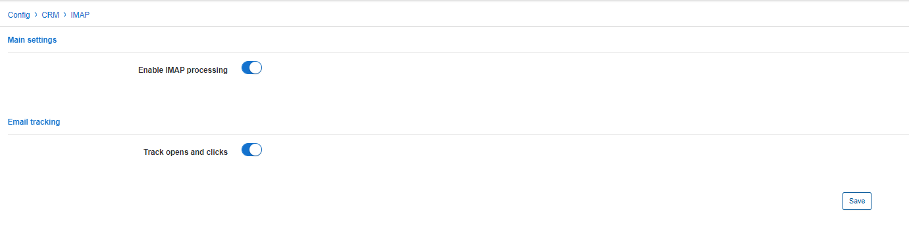

IMAP
===========

In this section we can configure basic settings of IMAP settings within the CRM module.

* **Enable IMAP processing** - enables/disables the syncing of emails on the system to and from the lead email address.

* **Track opens and click** - enables/disables recording of interactions with emails.
