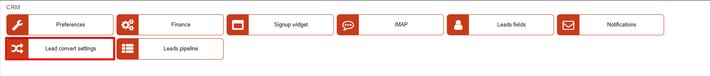
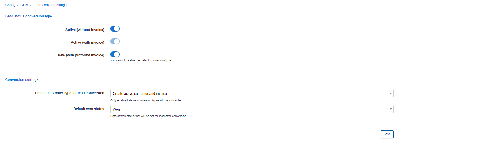

Lead convert settings
============

In this section we can customize parameters of lead conversions into customers.

### Lead status conversion type

With the following toggles we can select options to be available for the types of customers that will be created when leads are converted.

* **Active (without invoice)** - will create the lead as an active customer without an invoice.

* **Active (with invoice)** - will create the lead as an active customer with an invoice derived directly from the quotation and service settings.

* **New (with proforma invoice)** - will create the lead as an active customer with a proforma invoice derived directly from the quotation and service settings

Toggles with a dimmed color means that it has been selected as the default customer type for conversion and therefore, you cannot disable it.

### Conversion settings

* **Default customer type for lead conversion** - select which type of conversion is selected by default.

* **Default won status** - select which status will be given to the lead by default after being converted to a customer. *(Status available here will derive from pipeline status created for the **Won** stage)*
