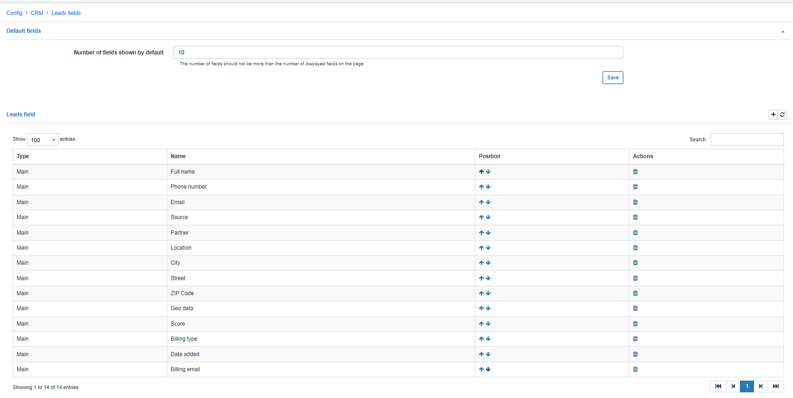

Leads fields
==============

In this section we can configure parameters of fields used for leads specifically.

### Default fields

* **Number of fields shown by default** - specify the number of fields which can be displayed to the leads information page by default. If more fields need to be viewed, the expand icon should be used to view those fields.

* **Leads field** -  specify the fields to be available for leads, you can also reposition, delete or add new fields from the main system fields or additional fields available.

When adding a field, you will be presented with a window to select where to add a field from in the *Type* field and you will be required to specify a key word to find the field in the *Name* field:

