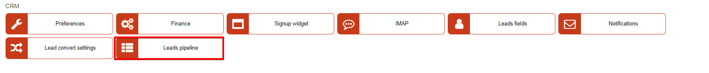
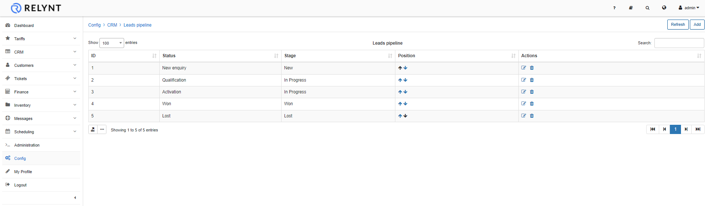
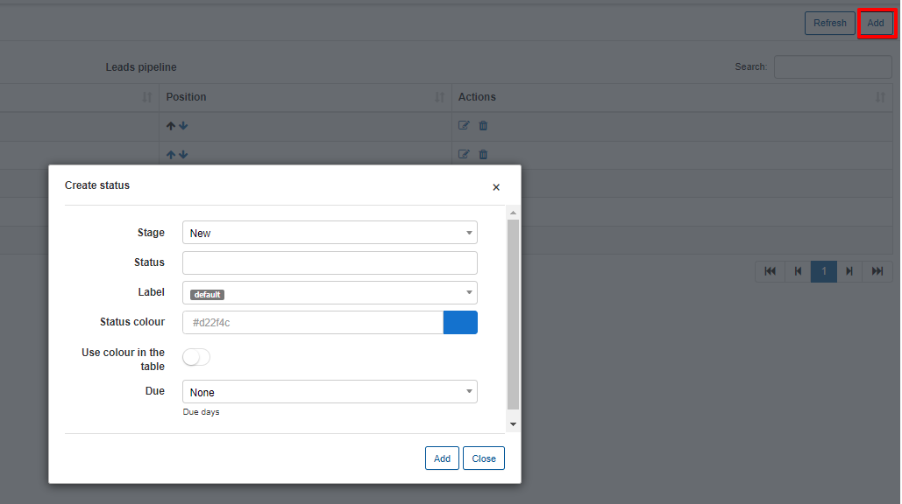

Leads pipeline
================

Previously known as Lead *stages*, Lead pipelines are to classify the status of the lead and each status used for leads can be added/removed or changed here.

Lead stages are default values within the CRM module and represents the progression of the lead within the onboarding process. Each pipeline status created has to be associated with a lead stage accordingly.

To add a new pipeline status, simply click on the "Add" button and the create lead stage window will appear:

* **Stage** - select which stage this status will be associated with.

* **Status** - specify a name for the Status.

* **Status color** - select a color to represent the pipeline status.

* **Use color in the table** - enable/disable representing the color on the table of leads.

* **Due** - specify a number of days the completion of processes are to be completed for this stage.(optional)

The new status will be available for leads on your system and you can select it in each relevant section.
