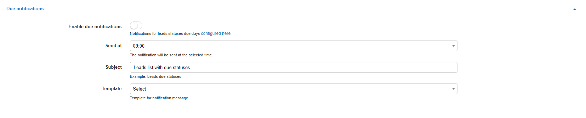

Notifications
============

In this section we can customize notification settings sent from the CRM module.

### Due notifications

These are the settings for the notifications sent when statuses have been configured with due dates

* **Enable due notifications** - enables/disables sending of notifications for any statuses with due days. Due days can be configured in [Leads pipelines](configuration/crm/leads_pipeline/leads_pipeline.md)

* **Send at** - select at what time of the due date the notification will be sent.

* **Subject** - specify a subject for the email notification that will be sent.

* **Template** - select a template that will populate the text/contents of the notification.

### Reminder notifications

These are the settings for the reminders set when tasks, comments or to do items have been scheduled for a specific date and time.

* **Subject** - specify a subject for the email notification that will be sent.

* **Template** - select a template that will populate the text/contents of the notification.

### Quote notifications

These are the settings for the automation of notifications for quotations created for CRM leads. These settings are specific to the notification carrying the PDF quotation.

* **Auto-send notifications after creating a quote** - enables/disables the automatic sending of quotations created for leads

* **Send to** - select which method of sending to use to send quotation notifications *(Email, SMS or both)*

* **Subject** - specify a subject for the email notification that will be sent.

* **Email Template** - select a template that will populate the text/contents of the email notification.

* **SMS Template** - select a template that will populate the text/contents of the SMS notification.

* **Email Bcc** - specify address(es) which will be CC'd for all emails sent for quote notifications. You can use multiple addresses by separating them with a comma

* **Delay in sending notifications** - specify a delay in hours for automatically sending notifications after quotes have been created.

* **Notification days** - select which days that notifications can be sent on. The notifications will be sent after the selected delay on the first available day and hour

* **Notification hours** - select which hours notifications can be sent out. The notification will be sent after the selected delay on the first available day and hour.
