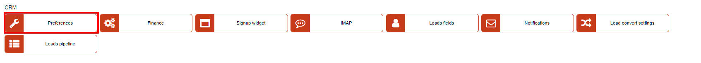

Preferences
=============
**_Config -> CRM -> Preferences_**

The following settings are configurable to your preference with regards to leads on the system.

### Leads

* **Show login** - enable/disable login for lead;

* **Enable generate login button** - enable/disable the ability to auto-generate logins with the next available login.

When a new lead will be added, the availability of the "Login" field will depend on the current/saved CRM preferences settings.

### Associate quote stages with lead pipeline statuses

This section allows you to select which pipeline status leads will be given automatically according to the quote status of the leads.

Options are: *New, In progress, Won, Lost*

Automation can be selected for the following quote statuses

* **Leads pipeline status for stage 'New'**

* **Leads pipeline status for stage 'Sent'**

* **Leads pipeline status for stage 'On review'**

* **Leads pipeline status for stage 'Accepted'**

* **Leads pipeline status for stage 'Denied'**

*Pipeline statuses can be customized in [Leads pipeline](configuration/crm/leads_pipeline/leads_pipeline.md)*
