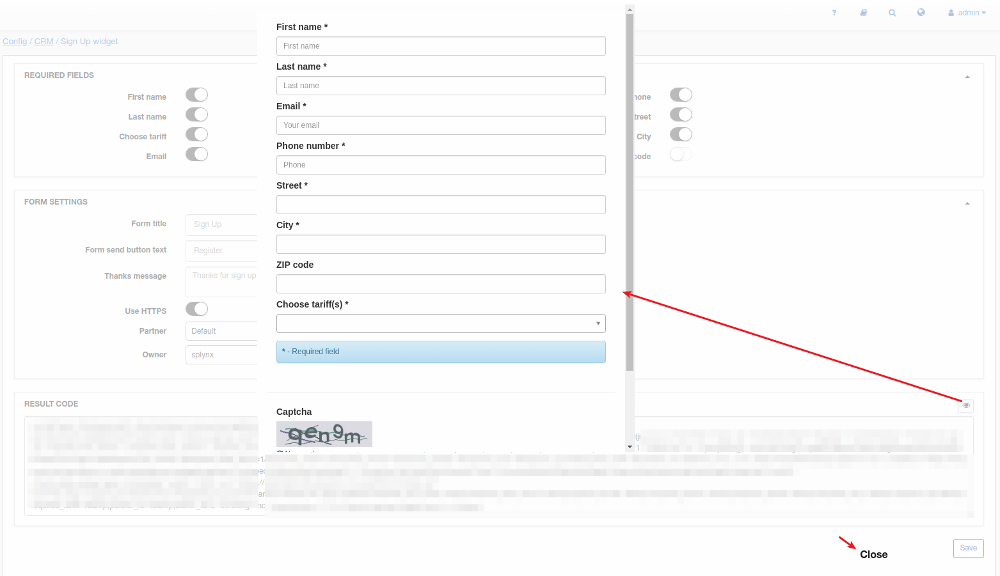

Sign Up widget
=============

We have developed this feature to support lead creation via other/company websites, directly to your Relynt server.

After configuring parameters and fields, saving this settings will manipulate the result code.

The result code can then be copied to your website and prospective customers will be able to register for your services (become lead in Relynt) directly from your website and they will be added to your CRM database automatically.  

# Form settings

Form details can be customized/changed here, the following fields are important and should be configured with special attention:

* Form title - specify a name for the form of the signup widget

* Form send button text - specify a name/phrase which will be displayed on the button to complete the signup process.

* Thank you message - specify a thank you message which will be displayed after the prospectoive customer clicks on the form send button

* Use HTTPS - if SSL configurations are configured and your Relynt server is on HTTPS, this options should be enabled at all times;

* Partner - select the partner that the lead will be associated with;

* Owner - the administrator assigned to or responsible for the lead, After the creation of the lead via the signup widget.

* Location - select the location that the lead will be associated with

* Pipeline status - select a pipeline status that will be given to leads automatically after signing up

* Choosing tariffs is required - enables/disables the selection of a tariff in order to complate the form. *(Only applies when tariffs are selected in the Tariffs field)*

* Tariffs - select which tariffs will be available to select from the drop-down list on the form.
*The system will create quations automatically based on the selection*

* Show Terms & Conditions checkbox - enables/disables the terms and conditions check checkbox

* Terms & Conditions template - select the template that contains the terms and conditions of your company and signing up. *(Only appears if Show checkbox is enabled)*

# Notifications settings

* Administrators who will receive notifications - select which Administrators will receive a notification when a new lead is create via the signup widget

* Notification email subject - Specify a subject of the email for the notification sent to administrators.

* Notification email template - select a template which will populate the text of the notification sent to administrators.

# Result code

After making changes, please be sure to click on the "Save" button to save these changes and the result code with your configured preferences will be ready for use. This should only be done when all configurations of parameters and fields have been configured to your preferences.

We have added the ability to check what prospective customers will see on your website by means of the "Preview" button:

After completing all required fields, leads will have to enter Captcha and submit this form. Thereafter, the lead will be created in Relynt.

# Form fields

Here we can select which fields should be available on the form of the signup widget. We can remove or change the position of each field, as well as add fields from the main system fields or additional fields on the system.

When adding a field, you will be presented with a window to select where to add a field from in the *Type* field and you will be required to specify a key word to find the field in the *Name* field, you can also select whether the field is required or not.:

