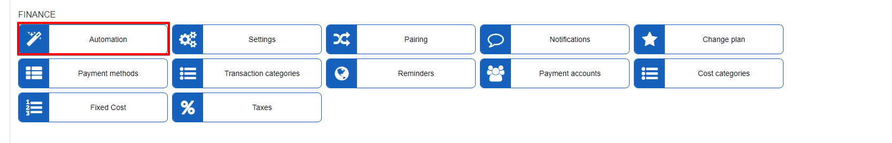
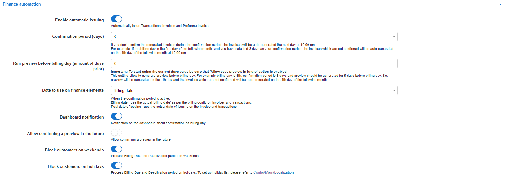
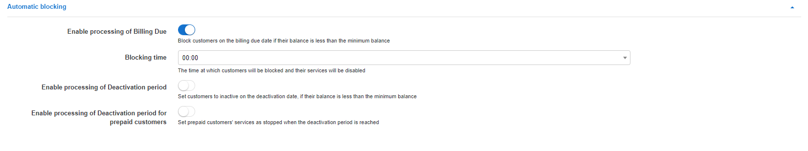
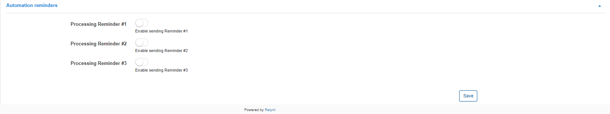

Automation
=============

To eliminate financial errors and delays caused by manual processes, in Relynt, you can configure finance automation in `Config → Finance → Automation`.

*Please note, these will be the global settings for finance automation of the system*.

The following parameters can be configured for automation:

### Finance automation

* **Enable automatic issuing** - enables/disables automatic issuing of Invoices, Transactions, and Proforma Invoices;

* **Confirmation period(days)** - set the date for automated confirmation of invoices/invoice batches/previews generated automatically, to execute automatic issuing/sending of invoices.

If you do not manually confirm invoice batches/previews generated automatically during the configured number of days, invoices will be auto-confirmed and issued/sent the day after the confirmation period, confirming the previews created will physically create the invoices and send them to customers. 
-i.e: if your confirmation period is set to 3 days, you have three days to check and manually confirm the invoices, and on the 4th day, the system will automatically do this if you have not done it yourself . The options to choose confirmation days are: 0, 3, 5, 10, 15, 20, 25, 30 days, or the last day of the month.

* **Run preview before billing day (amount of days prior)** - ***Important: To use this feature be sure that 'Allow confirming preview in the future' option is enabled***
This setting allows you to generate previews before billing day (create invoices for the upcoming month in the current month). For example the billing day is set to the 6th, with the confirmation period set to 3 days, and we configure this parameter to automatically generate previews 5 days before billing day. That means that previews will be auto-generated on the 1st according to the select of 5 days in this parameter, and if the previews are not manually confirmed within the **confirmation period**, the system will automatically create and send the physical invoices on the 4th day of the following month.

* **Date to use on finance elements** - here you can configure the dates of transactions and invoices issuing. It can be the billing day or the real date of issuing. For example, the billing day is on 1st day of the month and you have set 3 days as a confirmation period. In that case the invoice can be dated on the billing day regardless of confirmation days or the real date of issuing: maximum on the 4th day of the month (if you won't confirm issuing and invoices will be auto generated the next day);

***Please be advised! - When using the *Run preview before billing day (amount of days prior)* automation, please pay attention to this parameter as this will influence when the customer will be blocked, as the billing due parameter from customer depends on the date of charge.
So if you are using the `billing date` as the date to use, customer will be blocked according to the billing parameters you have selected. However, if you select `real date of issuing here`, you should manipulate the billing due parameter in relation to the date of charge. i.e: if you create invoices 15 days in advance automatically (Run preview before billing day (amount of days prior)), given that the billing day parameter is set to 1, and you only want customers to be blocked on the 5th of the new month, the billing due parameter for a 30 day month should be set to 19, as this will aid disregarding the 15 days prior to the actual billing date and give the customers 4 days after the actual billing days to make payments before the system will block them automatically***

* **Dashboard notification** - with this option enabled you will be notified on the Dashboard about confirmation on the billing day;

* **Allow confirming a preview in the future** - enables/disables the ability to save previews of invoices for upcoming months/future dated months (`Finance → History`);

* **Block customers on weekends** - enables/disables processing of billing due and grace periods on weekends.

* **Block customers on holidays** - enables/disables processing of billing due and grace periods on holidays. To set up holiday list, please refer to  [Localization](configuration/main_configuration/localization/localization.md)

### Automatic blocking

* **Enable processing of Billing Due** - enabling this process will lead to blocking non-paying customers on their billing due date and when their deposit is less than the minimum deposit/minimal balance allowed;

* **Blocking time** - the time at which customers will be blocked and their services will be disabled;

* **Enable processing Deactivation Period** - with this option enabled, non-paying customers will be set to an inactive status by the end of their Deactivation periods and when their deposit is less than minimum deposit/minimal balance allowed;

* **Enable processing of Deactivation period for prepaid customers** - enabling this option will set prepaid customers' services as stopped when their grace period is reached. (Prepaid grace periods can be set under `Config / Finance / Billing settings`)

### Automation reminders

* **Processing Reminder #1** - with this option enabled, Reminder #1 will be sent to the customer on the day set in [Reminder settings](configuration/finance/reminders/reminders.md);
* **Processing Reminder #2** - with this option enabled, Reminder #2 will be sent to the customer on the day set in [Reminder settings](configuration/finance/reminders/reminders.md);
* **Processing Reminder #3** - with this option enabled, Reminder #3 will be sent to the customer on the day set in [Reminder settings](configuration/finance/reminders/reminders.md).
