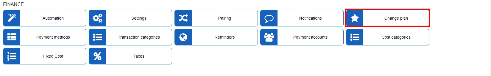
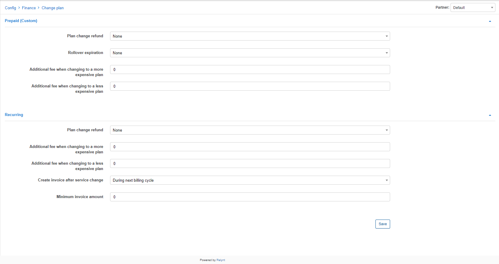

Change Plan
==============

This feature enables us to customize the behavior and conditions when customers request or apply plan/service changes. These parameters can be set differently for each partner in the system.

### Prepaid (custom)

These setting applies to customers assigned to the [Prepaid Billing](finance/billing_engine/prepaid_billing/prepaid_billing.md) engine.

* **Plan change refund** - select how to refund a customer for remaining service validity. Options are *Rollover unused or Refund unused money(to account balance in Relynt)*

* **Rollover Expiration** - select the amount of months to Rollover unused days

* **Additional fee when changing to a more expensive plan** - specify an amount to be charged additionally for changing to a more expensive plan

* **Additional fee when changing to a less expensive plan** - specify an amount to be charged additionally for changing to a less expensive plan

### Recurring

These setting applies to customers assigned to the [Recurring Billing](finance/billing_engine/recurring_billing/recurring_billing.md) engine.

* **Plan change refund** - select how to refund a customer for remaining service validity. Options are *Rollover unused or Refund unused money(to account balance in Relynt)*

* **Additional fee when changing to a more expensive plan** - specify an amount to be charged additionally for changing to a more expensive plan

* **Additional fee when changing to a less expensive plan** - specify an amount to be charged additionally for changing to a less expensive plan

* **Create invoice after service change** - select when the invoice for the new service and service change is to be generated. Options are *During next billing cycle, Immediately till the end of the active month, or Immediately till the end of the next month*

* **Minimum invoice amount** - specify a minimum amount of funds that an invoice generated for change plan should be
