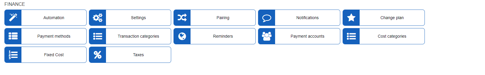

Finance configuration
=============

The finance module and valid configurations thereof is an important element of the Relynt billing system. The finance global configuration enables to you to configure the automation of the financial processes in Relynt, processes like pairing, notifications and reminder settings, payment accounts and payment methods, etc. In finance settings, you can configure global billing parameters of customers and define parameters of invoices, proforma invoices and receipts.

Please follow the links below for tutorial pages on each part of Finance configuration:

* [ Automation](configuration/finance/automation/automation.md)

* [ Cost categories](configuration/finance/cost_categories/cost_categories.md)

* [Change Plan](configuration/finance/change_plan/change_plan.md)

* [ Finance settings](configuration/finance/finance_settings/finance_settings.md)

* [ Fixed costs](configuration/finance/fixed_costs/fixed_costs.md)

* [ Notifications](configuration/finance/notifications/notifications.md)

* [ Pairing](configuration/finance/pairing/pairing.md)

* [ Payment accounts](configuration/finance/payment_accounts/payment_accounts.md)

* [ Payment methods](configuration/finance/payment_methods/payment_methods.md)

* [ Reminders](configuration/finance/reminders/reminders.md)

* [Taxes](configuration/finance/taxes/taxes.md)

* [ Transaction categories](configuration/finance/transaction_categories/transaction_categories.md)
