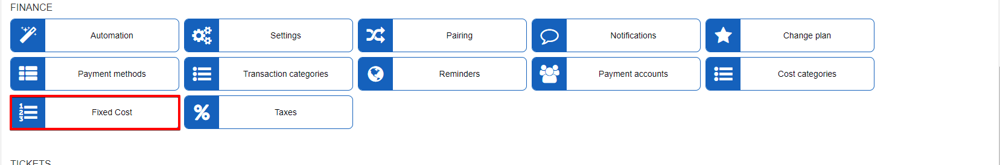
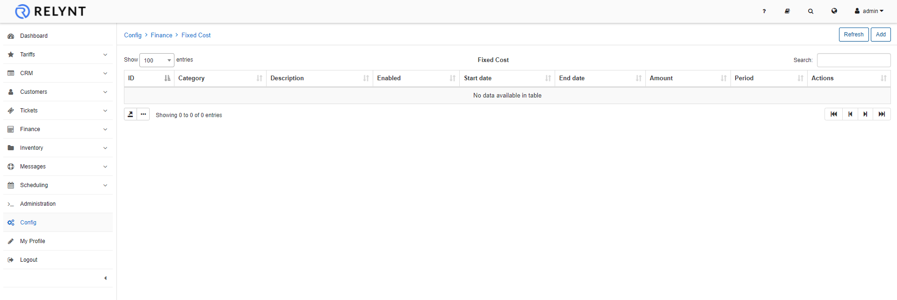

Fixed costs
====

In this section you can specify fixed expenses of the company like a salaries, these are static expenses of the company that can be used in calculations of expenses and financial reporting

Fixed costs can also be added in `Finance -> Costs`. 
