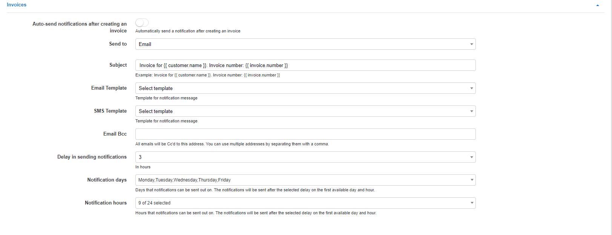
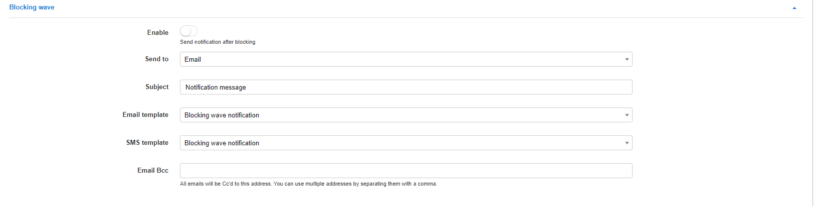

Notifications
=============

In this section we can configure the parameters for the notifications sent for finance module.

**Note** to send notifications via Emails - [email sending](configuration/main_configuration/email_config/email_config.md) must be configured, and to send notifications via SMS - [sms sending](configuration/main_configuration/sms_config/sms_config.md) must be configured

Notifications parameters can be configured for the global finance elements, specific parameters for the recurring billing engine, prepaid billing engine, and refill cards.

These parameters can also be customized for each partner on the system.

*For all notifications related to PDF documents, like invoices, payments receipts, etc. These parameters are for the notifications which carry those documents.*

# **Global**

#### Invoices

Notifications for invoices can be configured here:

* **Auto-send notifications after creating an invoice** - enables/disables auto sending of invoices after manual invoice creation;
* **Send to** - select which type of sending method to use, Email/SMS/Both
* **Subject** - notification email subject;
* **Email Template** - select a email template to use for the body of the message(can be added under [Config/System/Templates/Email](configuration/system/templates/templates.md);
* **SMS Template** - select a SMS template to use for the body of the message(can be added under [Config/System/Templates/Email](configuration/system/templates/templates.md);
* **Email BCC** - send a copy to this email;
* **Delay in sending notifications** - delay in hours to send notifications after invoice creation;
* **Notification days** - available days to send notifications, the notifications will be sent out after the selected delay, on the first available day and hour;
* **Notification hours** - available hours to send notifications, the notifications will be sent out after the selected delay, on the first available day and hour.

#### Proforma invoices

Notifications for proforma invoices can be configured here:

* **Auto-send notifications after creating an invoice** - enables/disables auto sending of proforma invoices after creation;
* **Send to** - select which type of sending method to use, Email/SMS/Both
* **Subject** - notification email subject;
* **Email Template** - select a email template to use for the body of the message(can be added under [Config/System/Templates/Email](configuration/system/templates/templates.md);
* **SMS Template** - select a SMS template to use for the body of the message(can be added under [Config/System/Templates/Email](configuration/system/templates/templates.md);
* **Email BCC** - send copy to this email;
* **Delay in sending notifications** - delay in hours to send notifications after proforma invoice creation;
* **Days on which notifications can be sent** - available days to send notifications, the notifications will be sent out after the selected delay, on the first available day and hour;
* **Hours at which notifications can be sent** - available hours to send notifications, the notifications will be sent out after the selected delay, on the first available day and hour.

#### Payments

Notifications for payments can be configured here:

* **Auto-send notifications after creating payments** - enables/disables auto sending of notifications when payments are created;
* **Send to** - select which type of sending method to use, Email/SMS/Both
* **Subject** - notification email subject;
* **Email Template** - select a email template to use for the body of the message(can be added under [Config/System/Templates/Email](configuration/system/templates/templates.md);
* **SMS Template** - select a SMS template to use for the body of the message(can be added under [Config/System/Templates/Email](configuration/system/templates/templates.md);
* **Email BCC** - send copy to this email;
* **Delay in sending notifications** - delay in hours to send notification after payment creation;
* **Days on which notifications can be sent** - available days to send notifications, the notifications will be sent out after the selected delay, on the first available day and hour;
* **Hours at which notifications can be sent** - available hours to send notifications, the notifications will be sent out after the selected delay, on the first available day and hour.
* **Attach receipt** - enable/disable attaching the payment receipt to the notification.
* **Attach related invoice / proforma invoice** - enable/disable attaching the invoice/proforma invoice related to the payment.

# **Recurring**

#### Blocking wave

Blocking wave notifications can be configured here:

* **Enable** - enables/disables sending of notifications after blocking of customers;
* **Send to** - type of notification: email, SMS or email+SMS;
* **Subject** - subject of the notification;
* **Email template** - select a template for email notifications(can be added under [Config/System/Templates/Email](configuration/system/templates/templates.md);
* **SMS template** - select a template for SMS notifications(can be added under [Config/System/Templates/SMS](configuration/system/templates/templates.md);
* **Email BCC** - send a copy of the notification to this email;
* **Hour to send at** - select the hour of day to send this notifications.

#### Inactive wave

Inactive wave notifications can be configured here:

* **Enable** - enables/disables sending of notifications when customers become inactive;
* **Send to** - type of notification: email, SMS or email+SMS;
* **Subject** - subject of notification;
* **Email template** - select a template for email notifications(can be added under [Config/System/Templates/Email](configuration/system/templates/templates.md);
* **SMS template** - select a template for SMS notifications(can be added under [Config/System/Templates/SMS](configuration/system/templates/templates.md);
* **Email BCC** - send a copy of the notification to this email;
* **Hour to send at** - select the hour of day to send this notifications.

# **PREPAID(CUSTOM)**

#### Main settings

* **Hour to send at** - select the hour of day to send notifications.

#### Blocking wave

Blocking wave notifications can be configured here:

* **Enable** - enables/disables sending of notifications after blocking of customers;
* **Send to** - type of notification: email, SMS or email+SMS;
* **Subject** - subject of notification;
* **Email template** - select a template for email notifications(can be added under [Config/System/Templates/Email](configuration/system/templates/templates.md);
* **SMS template** - select a template for SMS notifications(can be added under [Config/System/Templates/Email](configuration/system/templates/templates.md);
* **Email BCC** - send a copy of the notification to this email.

_These are notifications sent to customers assigned to the **Prepaid (custom)** billing engine as reminders of their service validity period._

#### First notifications wave

First wave notifications can be configured here:

* **Enable** - enables/disables sending of notification;
* **Amount of days before blocking** - select an amount of days before blocking to send this notifications;
* **Send to** - type of notification: email, SMS or email+SMS;
* **Subject** - subject of notification;
* **Email template** - select a template for email notifications(can be added under [Config/System/Templates/Email](configuration/system/templates/templates.md);
* **SMS template** - select a template for SMS notifications(can be added under [Config/System/Templates/SMS](configuration/system/templates/templates.md);
* **Email BCC** - send a copy of the notification to this email.

#### Second notifications wave

Second wave notifications can be configured here:

* **Enable** - enables/disables sending of notifications;
* **Amount of days before blocking** - select an amount of days before blocking to send this notifications;
* **Send to** - type of notification: email, SMS or email+SMS;
* **Subject** - subject of notification;
* **Email template** - select a template for email notifications(can be added under [Config/System/Templates/Email](configuration/system/templates/templates.md);
* **SMS template** - select a template for SMS notifications(can be added under [Config/System/Templates/SMS](configuration/system/templates/templates.md);
* **Email BCC** - send a copy of the notification to this email.

#### Third notifications wave

Third wave notifications can be configured here:

* **Enable** - enables/disables sending of notifications;
* **Amount of days before blocking** - select an amount of days before blocking to send this notifications;;
* **Send to** - type of notification: email, SMS or email+SMS;
* **Subject** - subject of notification;
* **Email template** - select a template for email notifications(can be added under [Config/System/Templates/Email](configuration/system/templates/templates.md);
* **SMS template** - select a template for SMS notifications(can be added under [Config/System/Templates/SMS](configuration/system/templates/templates.md);
* **Email BCC** - send a copy of the notification to this email.

For example, a customer will be blocked on 26th of the current month, today we are on the 3rd and all 3 wave notifications are enabled. The customer will receive the first notification 10 days before blocking(16th day of the month), the second notification 5 days before blocking(21th day of the month) and the third 1 day before blocking(25th day). All notifications will be send at that the time you have specified in "Hour of sending".

# **CARD EXPIRATION NOTIFICATIONS**

Notifications for customer who use refill cards to pay for services can be configured here.

* **Enable** - enables/disables sending of notifications for refill cards expiration;
* **Send to** - type of notification: email, SMS or email+SMS;
* **Subject** - subject of notification;
* **Email template** - select a template for email notifications(can be added under [Config/System/Templates/Email](configuration/system/templates/templates.md);
* **SMS template** - select a template for SMS notifications(can be added under [Config/System/Templates/SMS](configuration/system/templates/templates.md);
* **Email BCC** - send a copy of the notification to this email;
* **Days until expiration** - Select the number of days to send the notifications before expiration.
* **Notification hour** - select the hour of day to send notifications.
