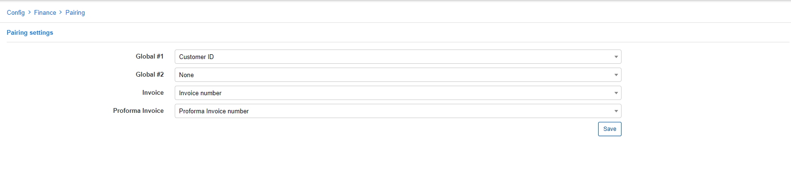

Pairing
=============

Before processing Bank statements, it is necessary to define pairing parameters first. The bank statement processing feature allows you reconcile payments receivable with invoices issued by pairing them, so it can proceed multiple payments.

In this section you will define parameters to pair details on Bank statements with Invoices or Proforma Invoices on Relynt: Global #1 or #2 parameters pair the details of customers from payments on bank statements with Invoices or Proforma Invoices parameters on Relynt.

For Global parameters #1 and #2 the following options are available to select:

* None
* Customer ID
* Customer login
* Customer Birthday\ Firm ID
* Contract ID

To pair selections made in Global #1 and/or #2 to Invoice parameters the following options are available to select:

* None
* Invoice number
* Invoice ID
* Contract ID

To pair selections made in Global #1 and/or #2 to Proforma Invoice parameters the following options are available to select:

* None
* Proforma Invoice number
* Proforma Invoice ID
* Contract ID

After defining Pairing parameters you can process bank statements accordingly. More information about bank statement processing can be found [here](finance/bank_statement_processing/bank_statement_processing.md).
