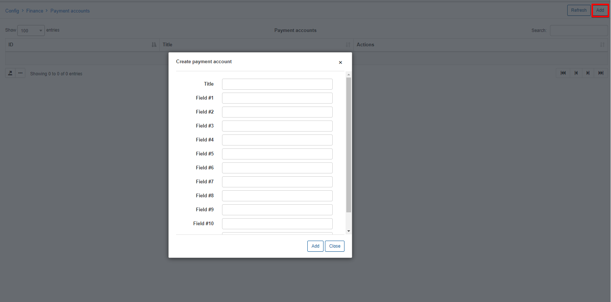
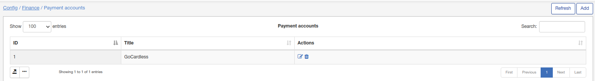
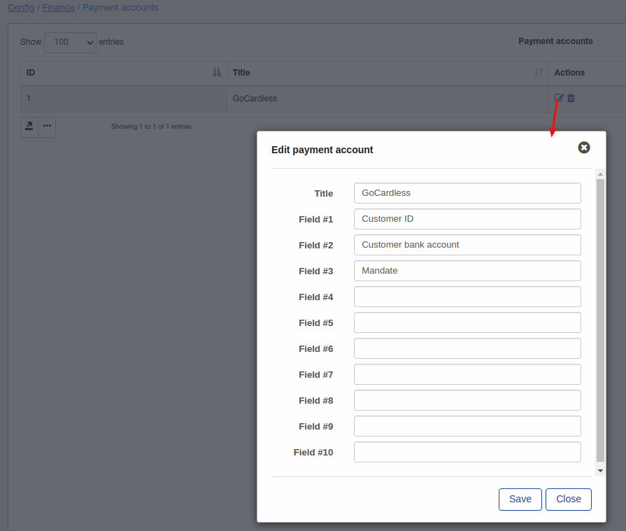

Payment accounts
====

Relynt has the ability to integrate with payment systems for payment processing and/or providing customers wit a method of paying for their invoices.

Payment accounts are used to record customer account details which can be used for payment systems. Each payment system will generally create a payment account automatically which will appear on the customer's profile and the details simply need to be provide/inserted. However, we can add payment accounts with our preferences to record customer accounts on the system with the details we prefer/require.

To add a payment account simply click on *Add* in the top right corner of the page:

* **Title** - Specify a name of the account. (relevant to it's purpose, eg; Banks name, etc)
* **Field #(1-10)** - You can specify the name of each field that the customer will need to provide details for.
* **Validotor file** - Specify attributes for validation (optional)

Creation of custom payment accounts are not common and we recommend contacting support for assistance before attempting to do this for any reason, to ensure the expected outcome.

As mentioned, all payment systems available on our system automatically creates a relative payment account as per its requirements.

For example wehave installed the [GoCardless addon](payment_systems/gocardless/gocardless.md) and  customers will be able to pay for their invoices with GoCardless directly from the Relynt customer portal, the new payment account will be created automatically. Please do not change payment accounts that have been added automatically.

After the GoCardless addon installation, a new payment account was created, let's check what fields this account contains:

If you intend to add a payment account for a customer from the admin panel, you will have to specify all the customer in the fields as per the field name:

