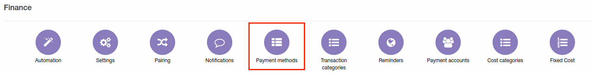

Payment methods
=============

In this section we can view/edit/delete or add payment methods which can be assigned to customer accounts.

Payment methods listed here are set by default. When you install a new payment module(ex. SageOne, Netcash, Stripe etc.) it will automatically appear here.  

You can add a new Payment method manually by clicking the *Add* icon at the top-right corner of the page.  The window will appear where you will type the name of the Payment Method and enable/disable the option with *"Active"* toggle, as well as specify any additional fields to record details in payments when using the method, if necessary.

After adding a new Payment method it will be available to select in each customer's Billing settings in `Customers → View →Billing →Billing overview`.

