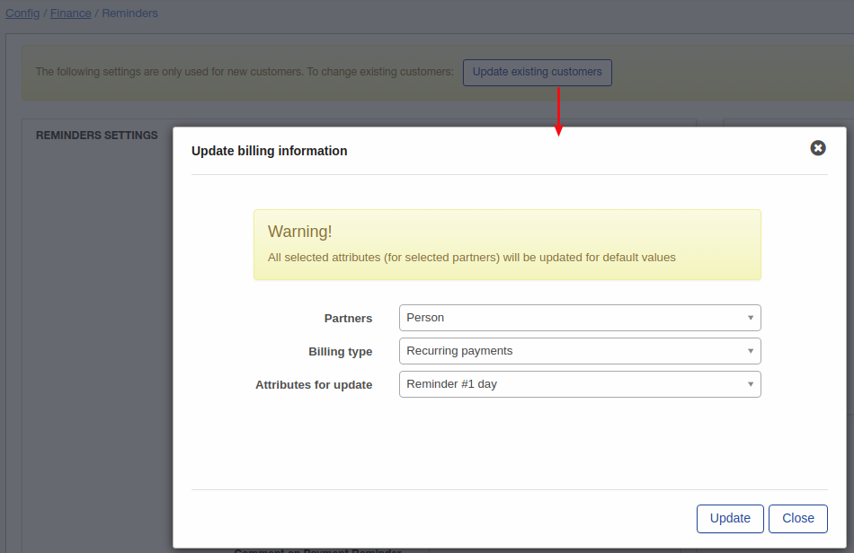

Reminders
=============

Payment reminders are email, SMS or email & SMS notifications sent to customers to remind them to pay for their due or overdue invoices.

Payment Reminders serve the same purpose as Prepaid(custom) wave notifications found in `Config / Finance /` [ Notifications](configuration/finance/notifications/notifications.md). The only difference is that Payment Reminders are used in the Recurring billing engine and Prepaid Notifications in Prepaid Billing engine.

Payment reminder settings can be customized globally for all Partners on the system:

The following parameters can be configured for reminders:

* **Enable Reminders** - enables or disables automatic sending of reminders;
* **Message type** - select the method of sending reminders: Email, SMS, Email+SMS.
* **Hour to send at** - select a time to send reminders;
* **Reminder #1 day** - select in how many days you'd like the First Reminder to be sent (relative/from the billing day or date of issuing invoices);
* **Subject #1** - type a subject for the 1st Reminder;
* **Reminder #2 day** - select in how many days you'd like the Second Reminder to be sent (relative/from the date of sending the 1st reminder);
* **Subject #2** - type a subject for 2nd Reminder;
* **Reminder #3 day** - select in how many days you'd like the Third Reminder to be sent (relative/from the date of sending the 2nd reminder);
* **Subject #3** - type a subject for 3rd Reminder;
* **Payment for reminder #3** - we do not recommend using this option, please keep it disabled, this option will add a late payment penalty fee if enabled and reminder 3 has been sent given that the customer has not made a payment;
* **All available payment methods** - enables/disables the reminder for all payment methods for which to send notifications;
* **Reminder payment methods** - this option only appears when **All available payment methods** has been disabled, which will allow you to select specific payment methods to send reminders for
* **Amount on payment reminder** - select a late payment penalty amount for payment reminder 3;
* **Comment on payment reminder** - specify a comment on the payment reminder;
* **Attach unpaid invoices with reminders to email** - enable this option to attach unpaid invoices to the email.

All 3 dates selected for sending of reminders will be displayed in the "Calendar" next to "Reminders settings". In our example we chose 10 days for the Reminder #1, 5 days for the Reminder #2 and 5 days for the Reminder #3. That means reminders will be sent on 11th, 16th and 21st of of month accordingly.

These settings are global and to update existing customers with these settings you can use the "Update existing customers" button. For example I'd like to update the day for reminder #1, for customers in the partner "Person" and subscribed to the recurring billing type, the update will look as follows:

Another example is an update of the "Enable reminders" option for all Relynt customers. Let's imagine that it was disabled for all customers, we enabled it in the config and the next step is to update of customers:

