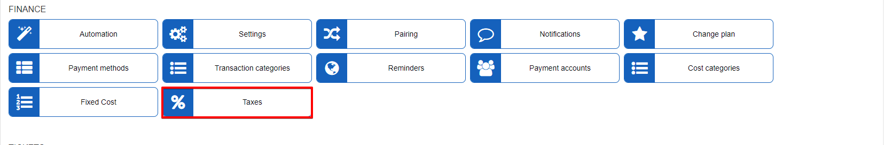
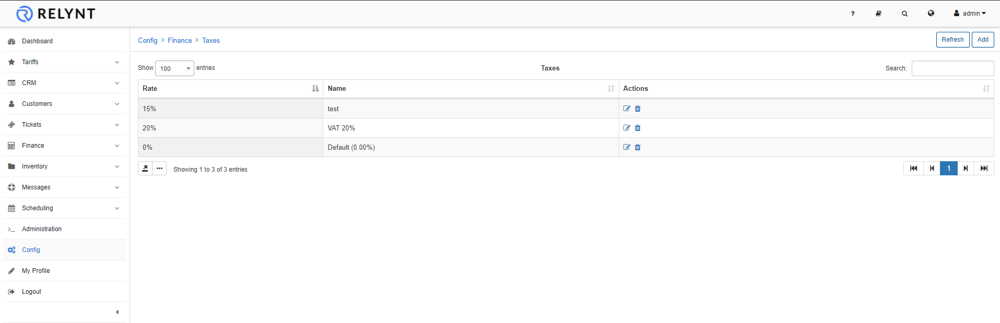
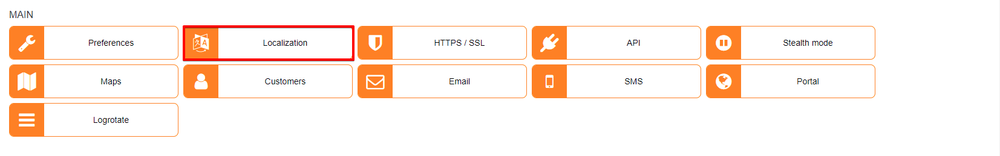
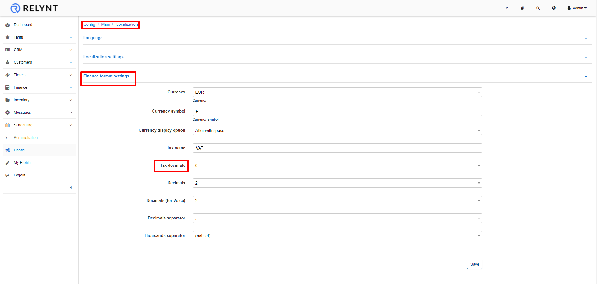
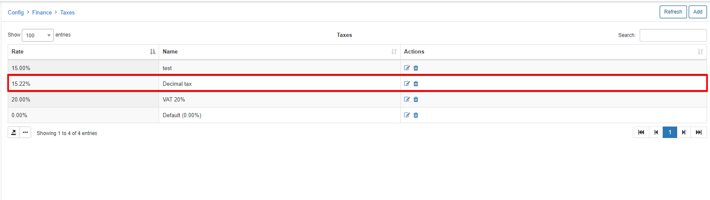

Taxes
=============
In this section, we can add, remove or edit tax rates on the system.

To add a new tax rate click on the "Add" button at the top-right of the page:

To add a tax rate with decimals, make sure to navigate to `Config -> Main -> Localization`, and select the amount of decimals for tax rates:

Once completed, you will be able to add tax rates with decimals:

