Transaction categories
=============

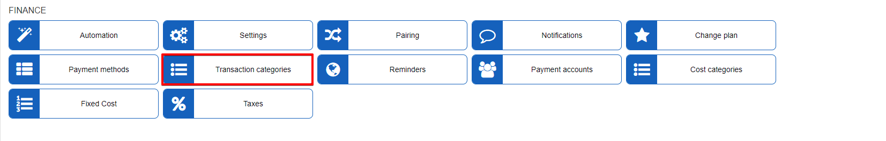

Transaction categories can be created and linked to services/sales on the system, which can be useful in reporting and statistical data. It is also a mechanism used when integrating an accounting platform with the system, as the transaction category will be used to pair invoice items on the accounting platform to services/items in Relynt.

#### Transaction categories

Transaction categories listed here are set by default and cannot be removed. Default categories can only be renamed with the use of the edit  icon in the actions column:

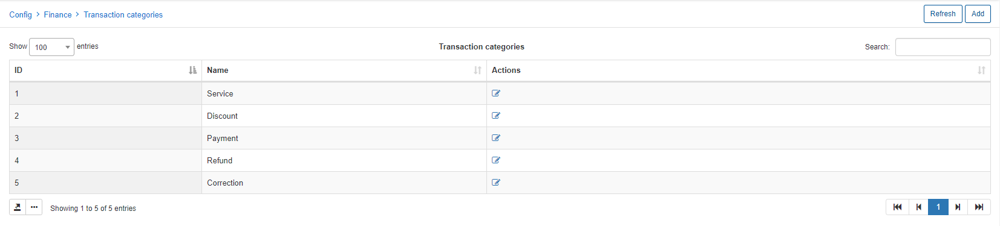

You can add a new Transaction category manually by clicking on the *Add* icon at the top-right corner of the page.

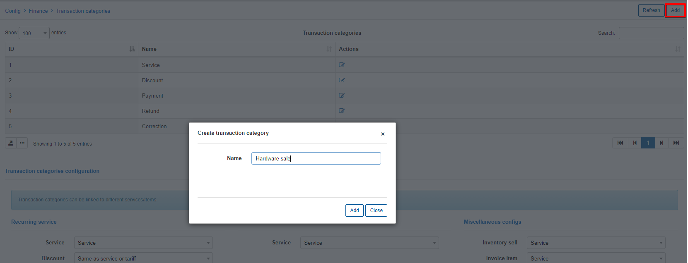

Transaction categories added to the system will be displayed on the same list as default categories, however these categories can be removed:

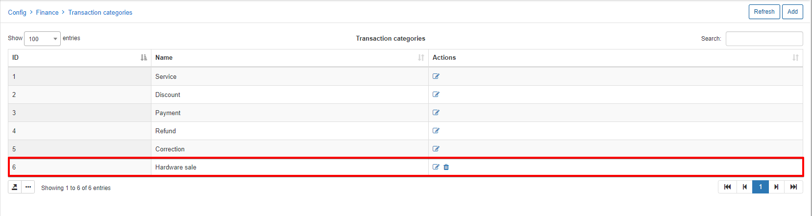

Once transaction categories has been added, we can then link them to services or items which create charges on invoices.

Additionally, you can also export or select fields to display on the table with the use of the icons at the bottom of the table 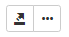.

#### Transaction categories configuration

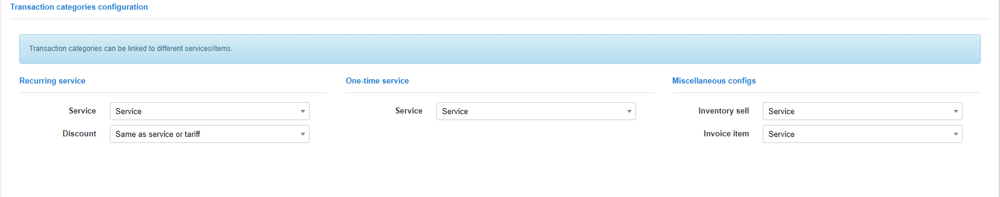

Mapping settings between sales of services(recurring or one-time), inventory sales and transaction categories is configured in this section. If all services have to be configured with this mapping it is necessary tp select the transaction category as "default for service type" in the configuration of each tariff. *(This is only possible if the transaction category has been enabled for tariffs):

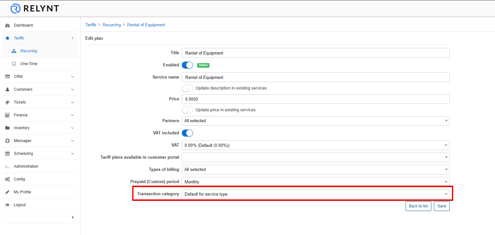

#### Transaction categories configuration for tariff plans

Custom mapping configuration for tariff plans can be enabled here, if any configurations were applied in the previous step in the "Transaction categories configuration".

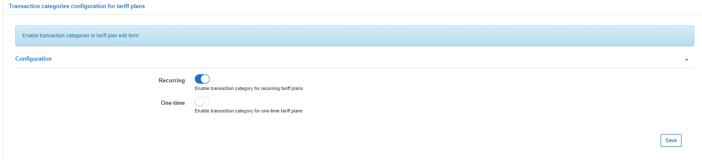

If these items enabled, it will be possible to select custom transaction categories when creating/editing tariffs. If disabled, the field will not appear and the configuration in the previous step will be used as the default settings.

After creating and configuring transaction categories, we can use them in billing customers:

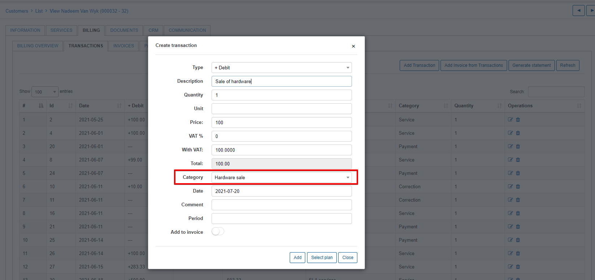

This will then be reflected in the reports of transaction categories in `Administration/Reports/Transaction categories report`:

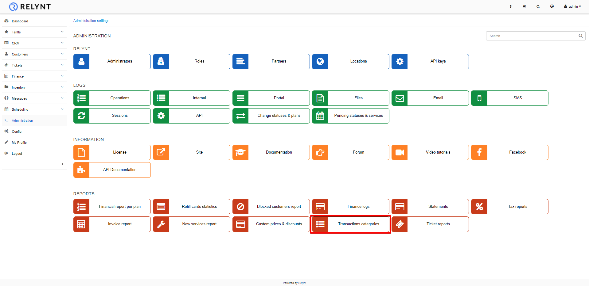

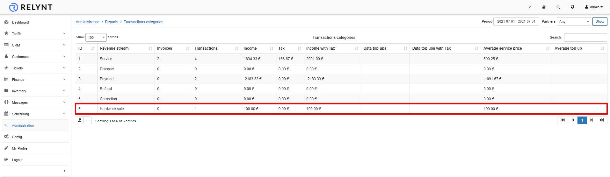
