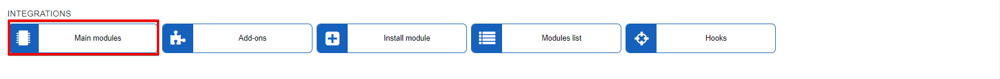
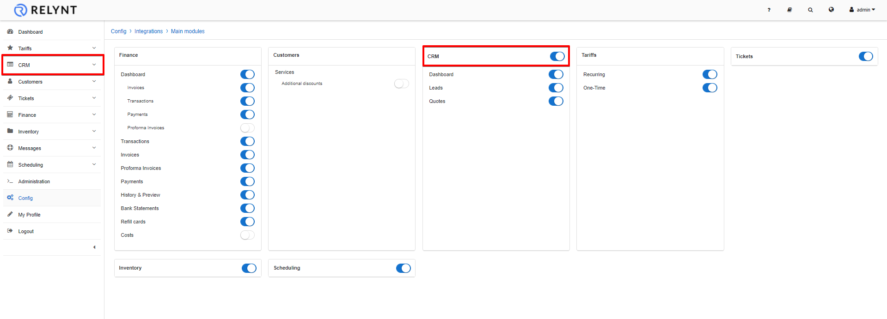
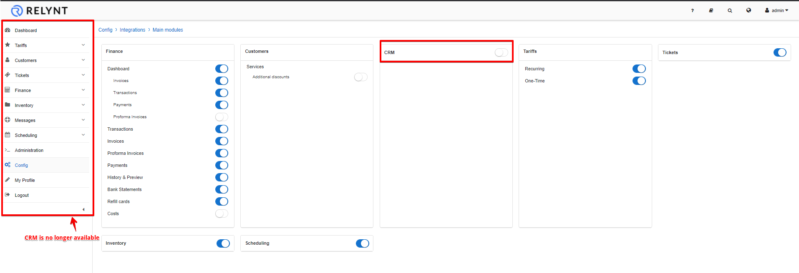
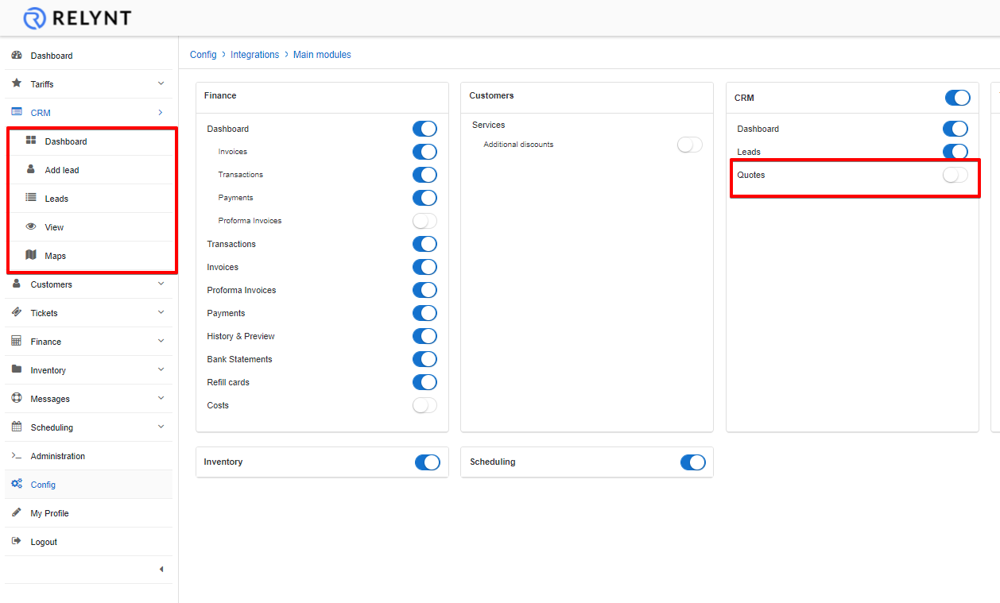
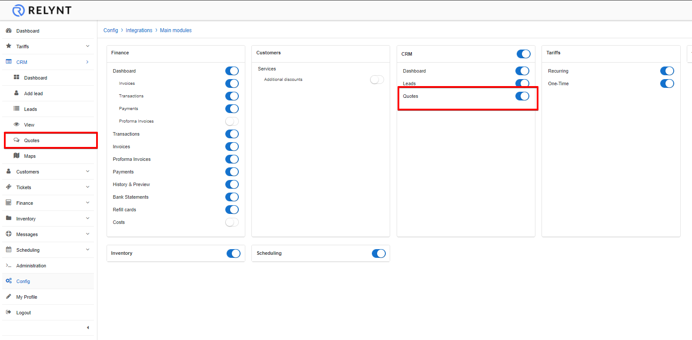

Main modules
=============

In section, Relynt modules which are not necessary or not in use, can be disabled or enabled.

### Be very attentive with these settings

Simply enable or disable each module as desired or required.

For example: We have enabled the CRM module

It is visible on the navigation pane, therefore we will be able to use the module.

 If we decide not to use the CRM module on our system, we can simply disable it:

As you can see the CRM module disappeared from our navigation pane.

We can also enable or disable sub-features of each module using the same logic described above:

CRM quotes disabled:

CRM quotes enabled:

