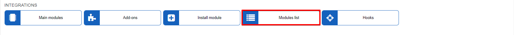
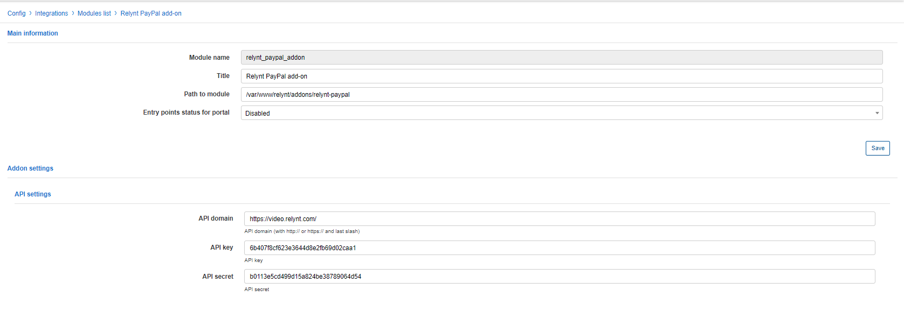
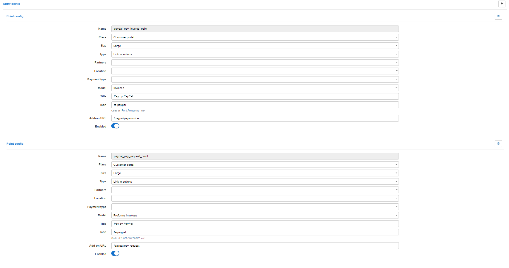
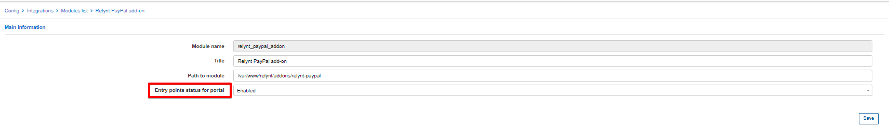
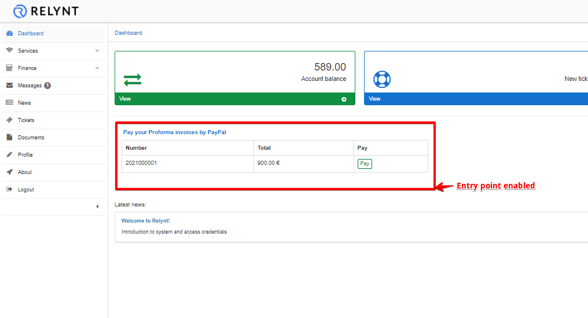
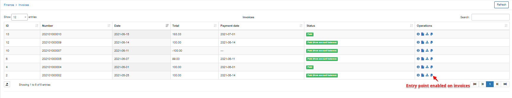

Modules list
=====

In this section you can configure addons which you have previously installed.

For example, we have installed the PayPal addon.

The module can be edited, removed and entry points can be configured(if the addon has entry points) here.

Let's edit the PayPal addon:

Please do not change the **API SETTINGS** if you are not sure of what it is and how it works. After making changes please don't forget to click "Save" to save your changes.

For a tutorial on installing the addon and configuration parameter descriptions, kindly view the following page: [Paypal payments](payment_systems/paypal/paypal.md)

Now we want to enable entry points for the customer's portal. Let's head back to the modules list and click on "Entry points":

We would advise you not to change any configurations here except that of enabling/disabling entry points. If you are going to use entry points on the portal, make sure that this option is enabled in the module configuration:

Once the entry points for the portal are enabled, let's see how it looks:

Customers can now pay for invoices directly from the portal using the PayPal addon.
