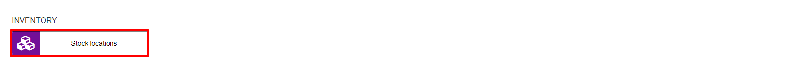
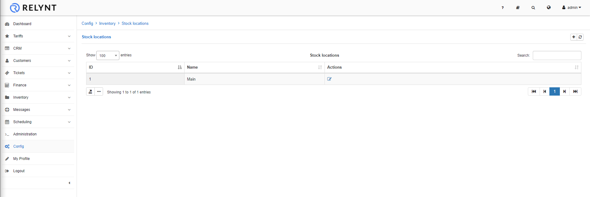
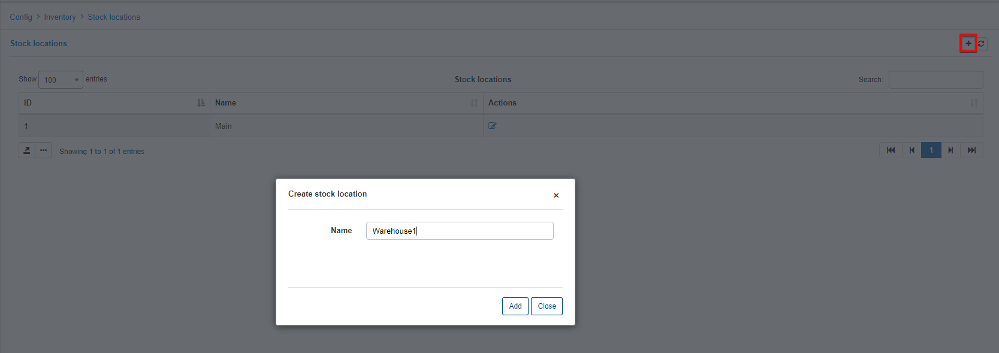
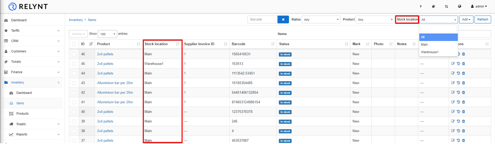
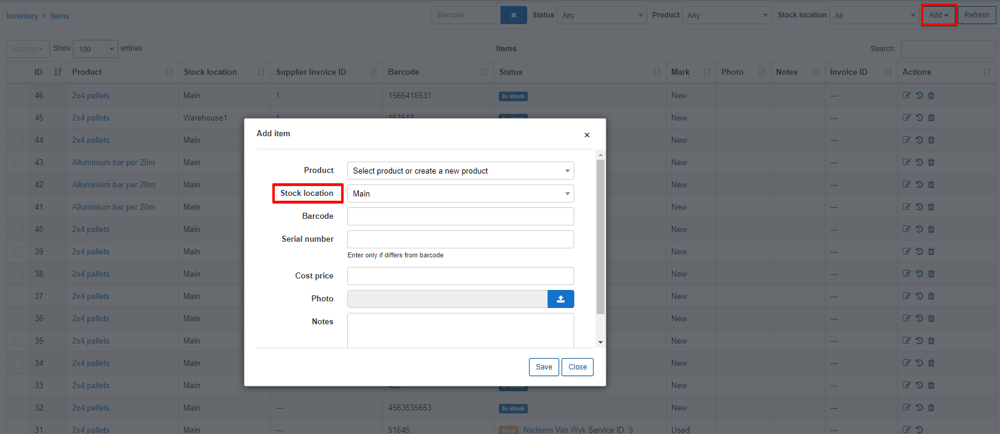
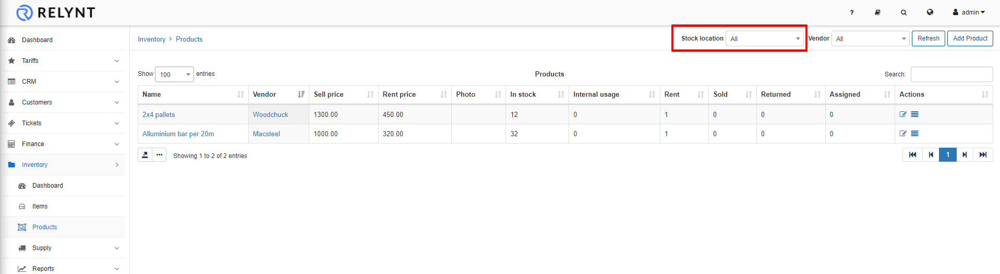
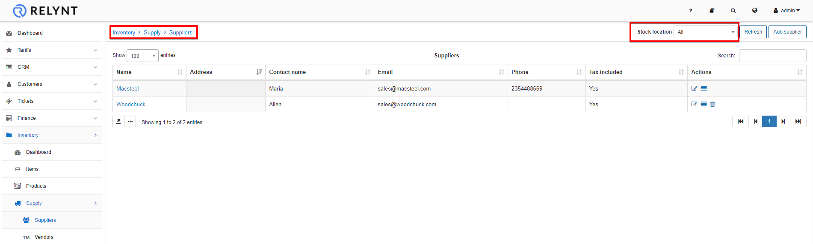
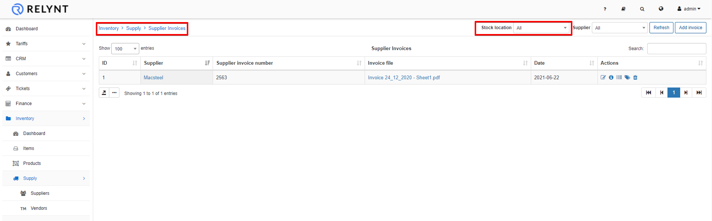

Stock locations
=============
We've developed stock locations to add your warehouses where equipment(inventory products & items) is stored.

"Main" is a default location and it cannot be removed, however it can be renamed.

To add a new stock location, simply click on the *Add/+* button at the top of the table and enter the location's name:

Stock locations are used to identify where inventory items/products are stored.

Navigate to **Inventory -> items**:

Stock locations can be selected for each item in the inventory. Also, a whole list of items can be sorted by stock location, simply select the desired location in the "Stock location" drop-down list.

When adding items you can select which Stock location the item is being stored:

Stock locations can also be used in the Products section of inventory.

Viewing Products:

Selecting a stock location will display any items of products assigned to a specific stock locationm

Suppliers and Supplier invoices can also be viewed by Stock location:

