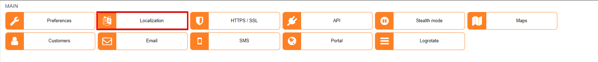
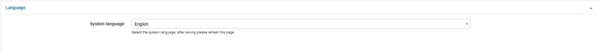
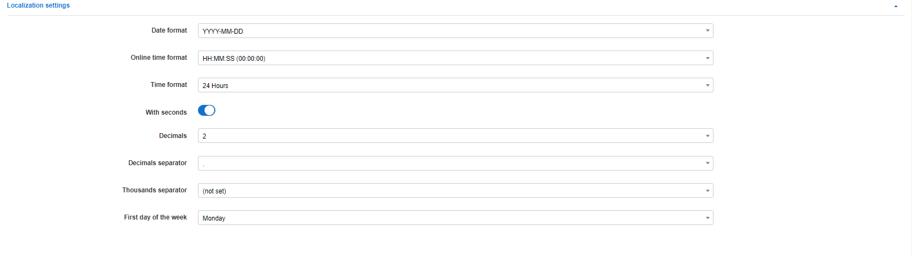
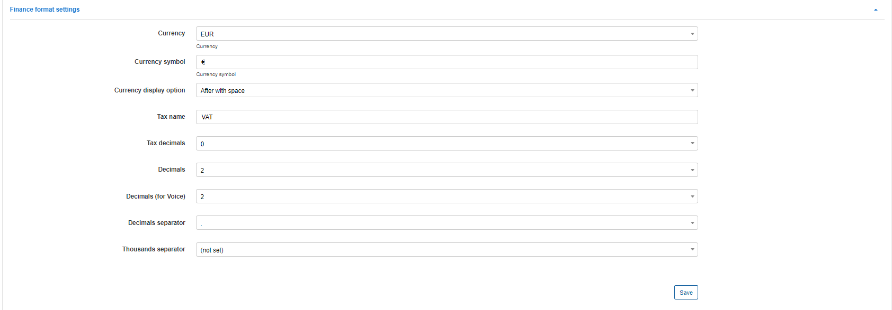
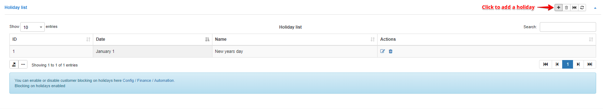

Localization
============

In this section we can configure system localization settings like language, date and time formats, as well as finance formats. We can also configure Holidays on the system which will be used in the automation of finance if blocking of customers has been disabled on Holidays.

## Language

* **System language** - select the system language.

## Localization settings

* **Date format** - select the date format which will be used in system;
* **Online time format** - select the online time format;
* **Time format** - select the type time format(12 or 24 hours);
* **With seconds** - enables/disables displaying of seconds;
* **Decimals** - specify the number of digits to display after the separator;
* **Decimals separator** - select a separator;
* **Thousands separator** - select a separator for thousands(if needed).
* **First day of the week** - select the first day of the week.

## Finance format settings

* **Currency** - select a preferred currency;
* **Currency symbol** - specify the currency symbol;
* **Currency display position** - specify where to display the currency symbol;
* **Tax name** - specify the tax name relevant to your country;
* **Tax decimals** - select tax decimals if needed (0, 2, 4);
* **Decimals** - select decimals if needed from 0 to 4;
* **Decimals(voice)** - select decimals for voice plans if needed
* **Decimals separator** - select a decimals separator (. , );
* **Thousands separator** - select a separator for thousands if needed  (, . ').

## Holiday list

We can add holidays into this table which will be used in the automation of finance if blocking of customers has been disabled on Holidays.
