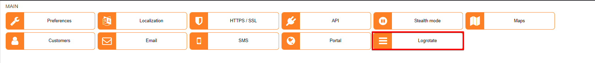
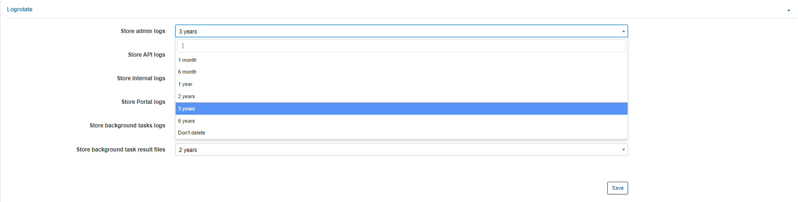

Logrotate
========

In this section you will be able to select a period of time for storing the following logs in Relynt:

##### Logrotate

* *Store admin logs*
* *Store API logs*
* *Store internal*
* *Store portal logs*
* *Store background tasks logs*
* *Store background task result files*

The period of time for storing logs can be 1 month, 6 months, 1 year, 2 years, 3 years or 6 years. It is also possible to select the option "Don't delete", which will store logs for all time.

