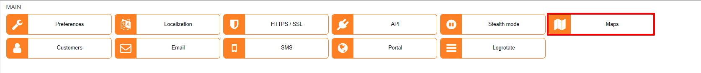
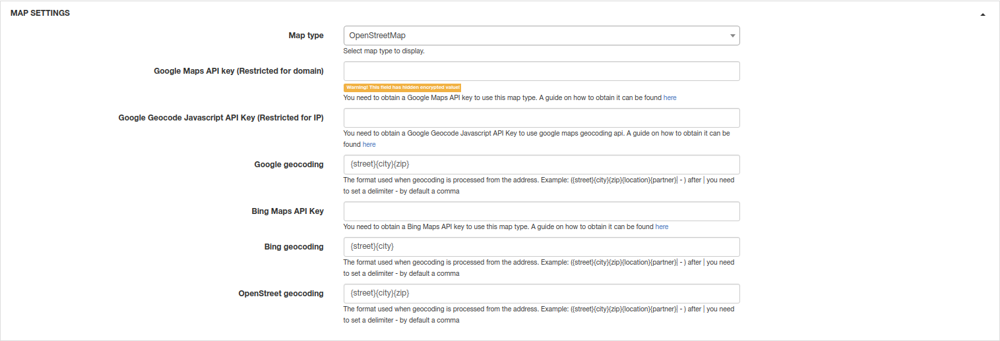

Maps
==================

In this section, we can integrate the Relynt system with a Map provider of preference from the ones available.

## Map settings

Maps can be configured here.

* **Map type** - select the map type: Openstreet, GoogleMaps or BingMap(OpenStreet does not require any configuration);
* **Google Maps API key (Restricted for domain)** - if the map type selected as GoogleMaps, the API key restricted for the domain must be placed here. [Guide how to get Maps API key](https://developers.google.com/maps/documentation/javascript/get-api-key)
* **Google Geocode Javascript API Key (Restricted for IP)** - if the map type selected as GoogleMaps Geocode. the JavaScript API key restricted for the IP must be placed here(IP of Relynt server). [Guide how to get JavaScript API key](https://developers.google.com/maps/documentation/javascript/get-api-key);
* **Google geocoding** - geocoding format used for Google Maps;
* **Bing Maps API key** - If BingMap is used, the Bing API key must be entered here. [Manual here](https://docs.microsoft.com/en-us/bingmaps/getting-started/bing-maps-dev-center-help/getting-a-bing-maps-key);
* **Bing geocoding** - geocoding format used for Bing Maps;
* **OpenStreet geocoding** - geocoding format used for OpenStreet maps.
