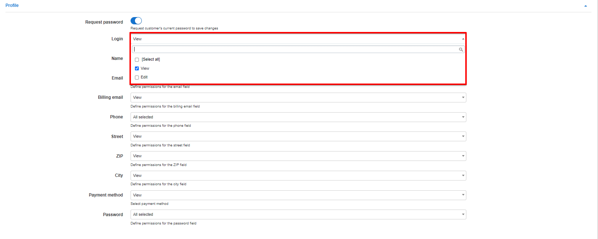

Portal
======

In this section we can configure parameters, permissions and other settings of the customer portal. We can customize the portal to display and function to our preferences with the fields provided.

To configure parameters of the Customer portal navigate to `Config → Main → Portal`.

The Customer Portal configuration includes the following sections:

## **General Settings**

### Main
This section of the portal configuration includes configurations of customer's authentication, password, ways of resetting password and languages in the Customer Portal.

**Parameter descriptions**:

* **Languages** - select the languages available for your Customer Portal
* **Authentication field** - select the method of customer's authentication, options available are: Email or Login
* **Reset password** -  enable or disable the option of resetting the password for the Customer Portal
* **Type of resetting password** - select the method of resetting passwords, options are: SMS or Email
* **Template for email message** - select the template of the email for resetting the password
* **Text for SMS message** - type the text for the SMS messages for resetting the password.
* **Characters for generate email check code** - specify the characters available to generate a email code.
* **Email check code length** - specify the number of characters to use when generating an email code.
* **Characters for generate SMS check code** - specify the characters available top generate a SMS code.
* **SMS check code length** - specify the number of characters to use when generating an SMS code

## Customer Mobile app

In this section, we can configure elements of the customer mobile app.

Parameter descriptions:

* **Enabled** - enables/disables the displaying of the mobile app download links on customer portal login page
* **Google Play App ID** - specify the Google play app ID, should be *com.Relynt.portal*
* **App Store App ID** - specify the AppStore App ID, should *id1462886761*

### Additional attributes in profile

In this section we can specify the permission to each additional  field in the My profile section of the customer portal:

Configuration of additional attributes to be seen in Customer portal, will be derived from the additional fields configured on the system for customers.
Items you've selected to be viewed only in the Customer Account will have dimmed fields and items that you've granted editing permissions to customers for, will be displayed with white fields.

Information about configuring Additional fields in Relynt can be found here - [Additional fields](configuration/system/additional_fields/additional_fields.md).

## **Per Partner Settings**

These configurations can be customized for each partner on the system.

### Main

* **Portal title** - specify a title for the Portal
* **GDPR enabled** - enables/disables GDPR practices in the portal.

### Menu
This is the configuration of main modules to be displayed in the Customer portal.
You can choose whether or not to display specific modules by ticking or unticking each module.

 Modules to choose from are: *Statistics, Services, Finance, Messages, Tickets, Documents, Profile, About, News*.

### Dashboard
This is the configuration of items to be shown on the Customer Dashboard.
Here you can enable the option Show Portal News and the last three portal news will be shown on a customer dashboard. The options to display CAP/FUP usage of active service and live bandwidth usage is also available here.

**Parameter descriptions**:

* **Items** - select the items to be displayed on the dashboard

You can select following items to be displayed on Customer Dashboard: *Balance, New Tickets, New Messages, Unpaid Invoices, Unpaid Proforma Invoices*.

* **Show portal news** - enables/disables the displaying of portal News

Below is an example of a Customer account in the portal with all items selected to be displayed in the navigation menu and on the Dashboard.

### Profile

This is the configuration of the customer profile which will give customers optiosn to view their contact information or to edit it. To be able to edit and save changes, customer's can be asked for their current password, for this to work, you should enable the option to *"Request Password"*.

Profile information includes:

* Login
* Name
* Email
* Phone
* Street
* ZIP
* City
* Payment method
* Password

For each of these items you can choose the actions available for the customer: View or Edit.

Items you've selected  to be viewed only in the Customer Account will have dimmed fields and items which customer can edit will be presented with white fields.

### Services

This is the configuration of services and service fields to be displayed in the Customer portal. You can also enable the option to display how many days is left until the end of the service, as well as whether or not to display the hardware linked to the customer. You can also select whether or not to display stopped and disabled features on the portal.

You can select the fields to be displayed for all recurring services:

* **Options for service fields** - *ID, Description, Plan, Price, Start date, End date, Stopped/Active service, Self-change of Tariff Plan, Request a Tariff plan change, Status*

  

* **Show days** - enables/disables the displaying of the amount of days left until the end of the service.

* **Hardware** - enables/disables the displaying of hardware linked to the customer

* **Show all services** - enables displaying all services including stopped and disabled services.

### Tickets

This is the configuration of fields to be displayed in the Tickets module of the Customer portal

Fields to be displayed in the module can simply be ticked or left unticked if you do not wish to display the field.

Fields available the tickets modules are:
*ID, Subject, Priority, Status, Group, Type, Assigned to, Watching, Created Date & Time, Updated date & time and Star*

### Finance

This is the configuration of financial items to be displayed in Customer portal such as: Invoices, Payments, Proforma Invoices and Transactions, and Payment methods available for Customer, for example, Refill cards. As well as the available payment methods for the customer and which transaction fields the customer can display.

----
##### Some fields need to be explained more detailed:

* **Change plan** - when this option is enabled, it will allow customers to apply for a plan change via the Customer portal by sending a request to technical support. When this option is enabled customers will see an <icon class="image-icon"></icon> icon in the *Actions* column in Services. By clicking on that icon a window "Change tariff", will appear where customers will select the parameters to perform a *Manual change request* (**If allowed**), or they can choose to click on *Request a tariff change*.

*Manual change request*

*Request a tariff change*

The window "Create ticket", will appear when clicking on *Request a tariff change*, where customers will choose the Priority of the ticket (Minor, Major, Critical) and write a short message. Customer can also upload a file by clicking on the Upload icon <icon class="image-icon"></icon> below the text message.

