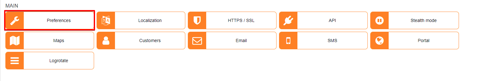
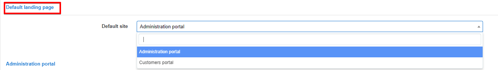
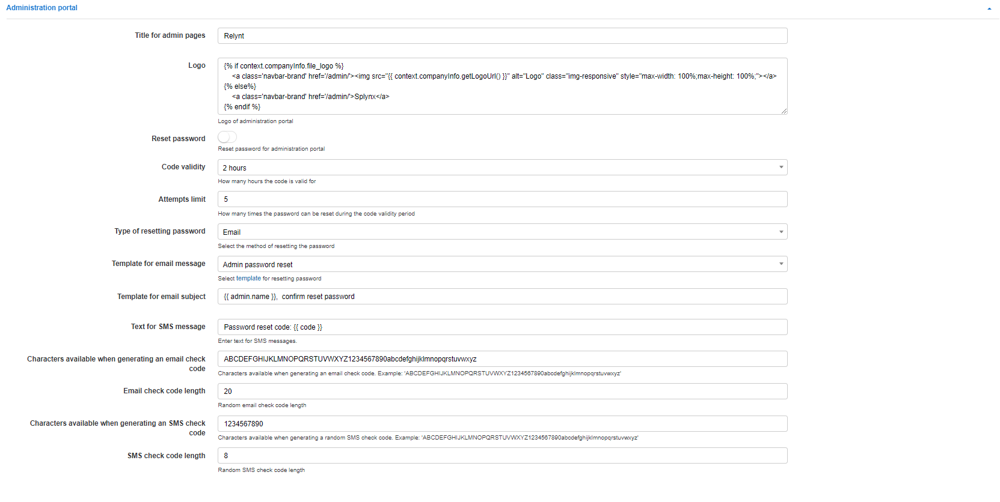
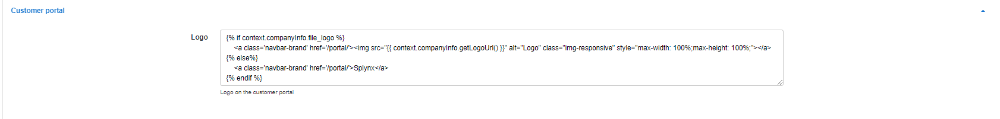
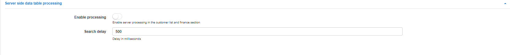
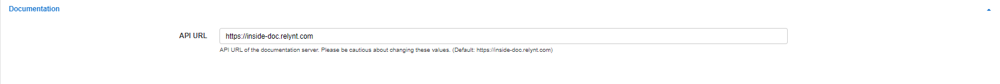
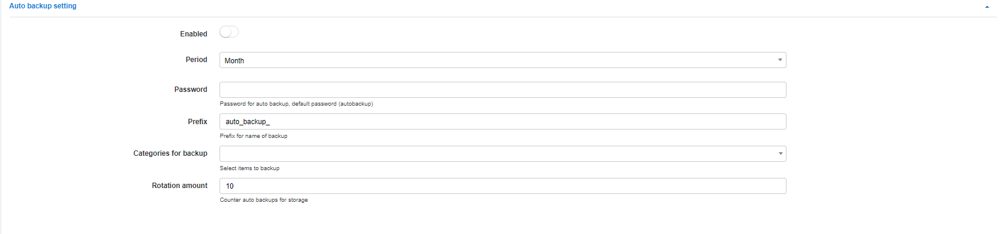
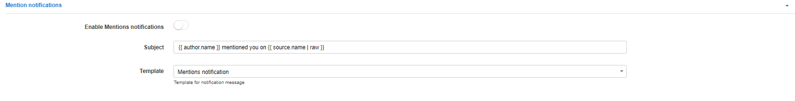
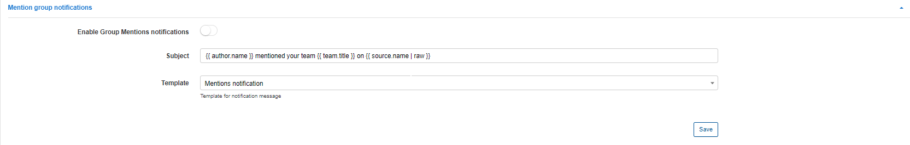
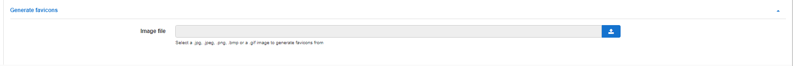

Preferences
==========

Basic settings of the administrator and customer portal can be configured in this section.

## Default landing page
This option allows you to select which page(customer or admin portal) will be opened when your Relynt URL is accessed, https://yourRelynt.com :

## Administration portal

The following settings apply to the admin portal only.

* **Title for admin pages** - header for the tab name in the browser(Relynt: Preferences, Relynt: Dashboard);
* **Logo** - default code for the admin portal logo. the size of the logo, and  other parameters can be changed here;
* **Reset password** - enables/disables the option to reset the password for the admin portal;
* **Code validity** - how many hours the code for the password reset is valid;
* **Attempts limit** - how many attempts can be made to change the password during the code validity period;
* **Type of resetting password** - select a method to reset password(Email or SMS);
* **Template for email message** - select the template for the email message to reset the password;
* **Template for SMS message** - select the template for the SMS message to reset the password;
* **Text for SMS message** - type the text for the SMS message with the code;
* **Characters available when generating an email check code** - specify the list of characters available for code generation via email;
* **Email check code length** - specify the length of the code for the email;
* **Characters available when generating an SMS check code** - specify the list of characters available for code generation via SMS;
* **SMS check code length** - specify the length of the code for SMS.

## Customer portal

Only the code of customer portal logo can be onfigured here, for more configurations of the portal, navigate to `Config / Main / Portal`.

## Server side data table processing

* **Enable processing** - enables/disables server processing in the customer list and finance section;

* **Search delay** - search delay in milliseconds.

## Documentation
Please do not change this field. It is used to load the built-in documentation.

## Auto backup settings

Settings used for auto backups.

* **Enabled** - enables/disables auto backup;
* **Period** - select a period for auto backup(Month, Week, Day);
* **Password** - specify a password for auto backups;
* **Prefix** - specify a prefix for the name of auto backup files;
* **Categories for backup** - select which items to backup(Full database, RRD files, templates, addons and handlers, uploads);
* **Rotation amount** - counter of auto backups for storage, will keep this amount of backups in rotation.

## Mention notifications

These notifications are used to notify administrators when they are mentioned within Tasks, the CRM module, Tickets, as well as in Customer comments.

* **Enable mentions notifications** - enables/disables mentions notifications;
* **Subject** - type the subject of the notification message;
* **Template** - select the template for notification body.

## Mention group notifications

* **Enable group mentions notifications** - enable/disable group mentions notifications;
* **Subject** - subject of notification message;
* **Template** - template for notification body.

## Generate favicons

We can upload image files containing favicons we wish to use within the system in the section:

