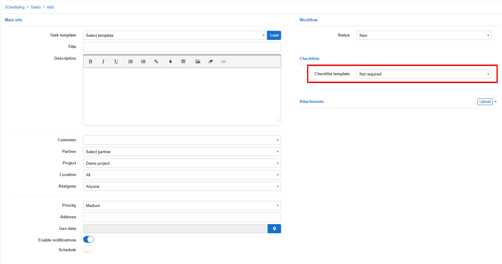

Checklist templates
=============
In this section we can add, edit or remove checklists that will be used in tasks. Checklists can be used to ensure progress is recorded and can form order of activities to be carried out within a task.

To add a new checklist simply click on the *Add* button at the top of the page

Select a title and add the relevant steps needed to complete the checklist.

Once the checklist has been created, it will be available to be used in tasks.

