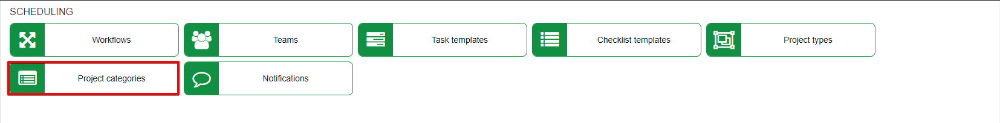
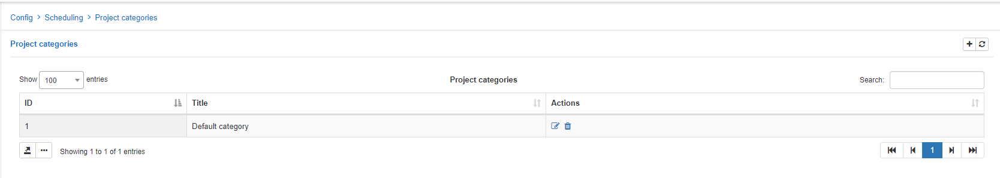
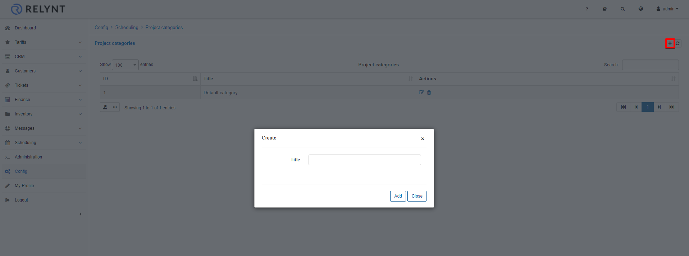
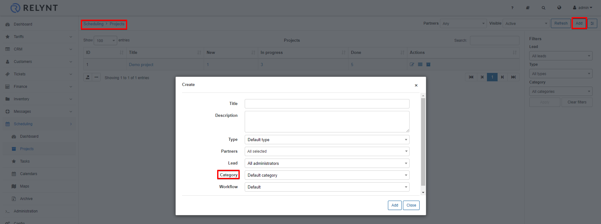

Project categories
=============
In this section we can add, edit or remove project categories.

Categories can be used to separate and classify projects by defining categories.

To add a new category simply click on the *Add/+* icon at the tom op the table:

Once the category has been added, it can be used when creating a new project:

