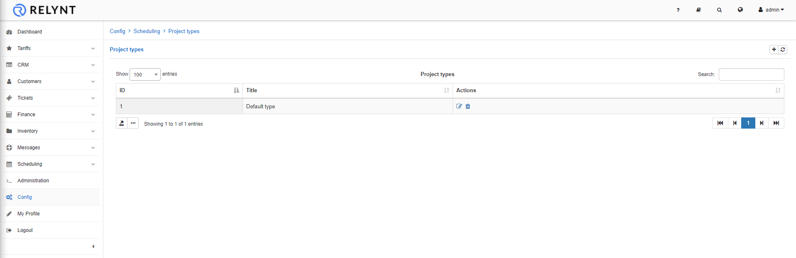
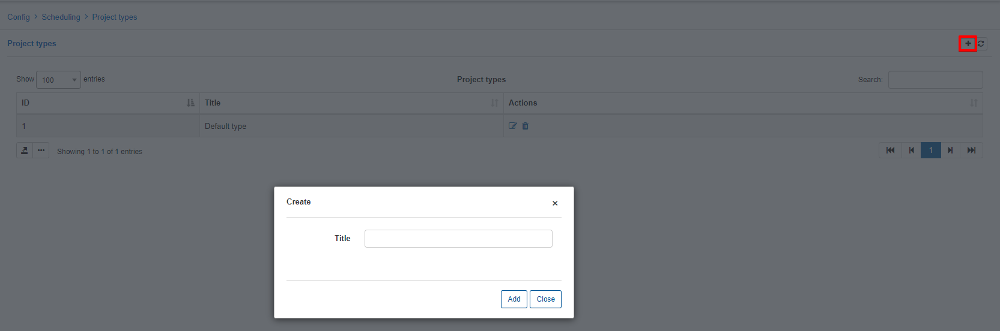
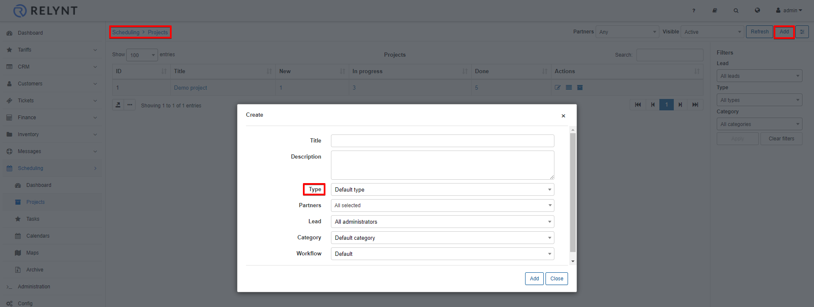

Project types
=============
In this section we can add, edit or remove project types.

Project types can be used to separate and classify projects by defining types.

To add a new project type, simply click on the *Add/+* button at the top of the table:

Once the project type has been added, it can be used when creating a new project:

