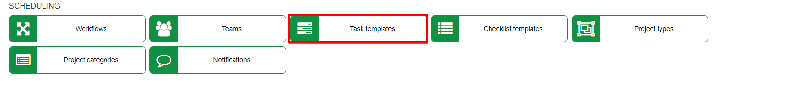
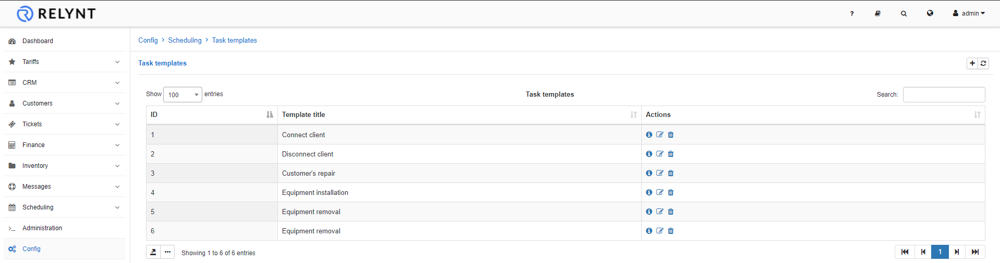
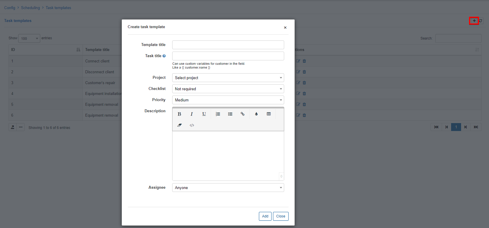
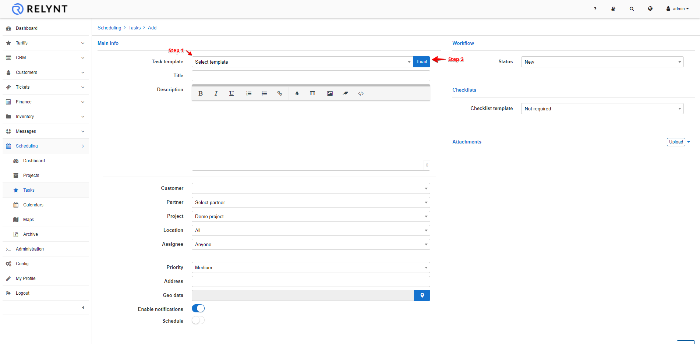

Task templates
=============
In this section we can add, edit or remove task templates.

Task templates are used to speed up task creation, you can use templates to load templates with preconfigured settings for the task.

To add a task template, simply click on the *add/+* button at the top of the table:

* **Template title** - specify a name for the template

* **Task title** - specify a predefined name for the task. *(custom variables for customers can be used in the field, like a {{ customer.name }})*

* **Project** - select which predefined project this template will be used for.

* **Checklist** - select a predefined checklist for the task

* **Priority** - select a predefined priority of the task

* **Description** - specify a predefined description of the taks

* **Assignee** - select a predefined team or administrator that the task will be assigned to.

Once task templates are created, we can use it when creating new tasks to autofill data and ultimately speed up the process of creating taks

To create a new task from a template, select the template in step 1 and click "Load", in step 2 as depicted in the image, thereafter the predefined data will be loaded from template.

