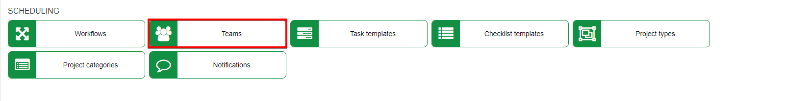
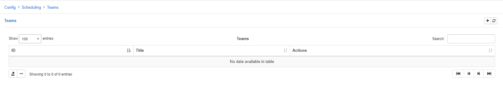
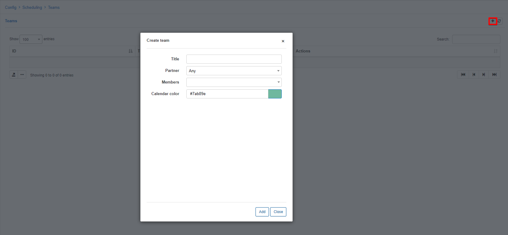
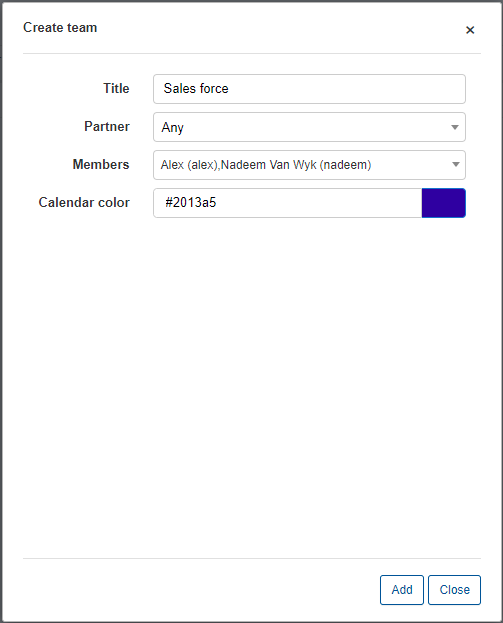
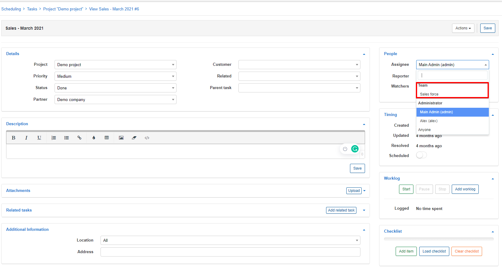

Teams
=============
In this section new teams can be added, changed or deleted.

Teams can be used to group administrators together for the collective activities to be fulfilled to complete tasks. Tasks that require skill sets/duties of administrators in different departments of the company can then be assigned to teams of administrators who will be involved in the activities of the task.

Because we have an empty list of teams, tasks can be only assigned to a specific administrator.

Let's add new team to make assigning tasks to teams possible.

Simply click on the *Add/+* button at the top of the table:

* **Title** - specify a name for the team.

* **Partner** - select which partner to create the team for. *Selecting a partner here will determine which administrators can be added to the team as members, based on which partner they belong to.*

* **Members** - select which administrators will be part of the team.

* **Calendar color** - select a color to represent the team within the calendar in scheduling.

Once a team has been created, scheduling tasks can be assigned to teams:

