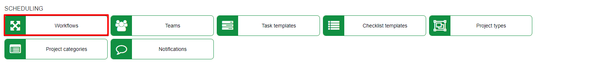
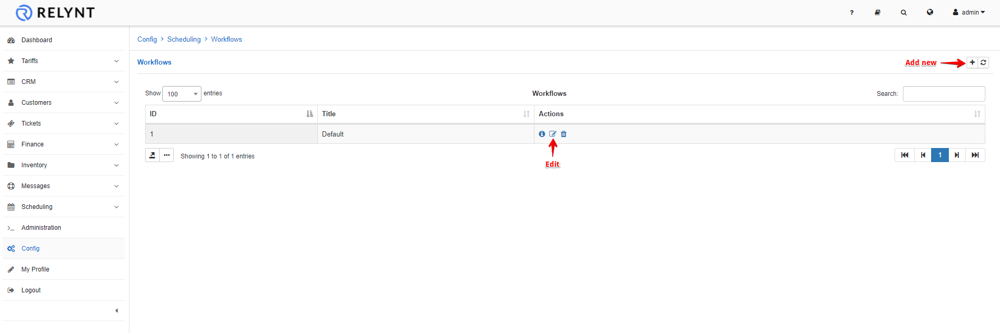
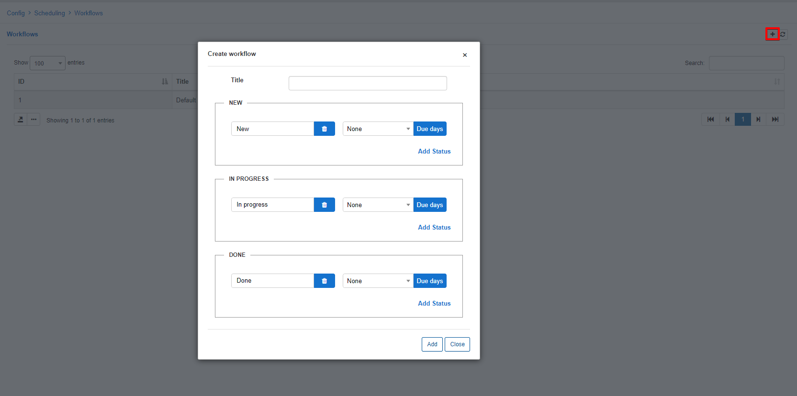
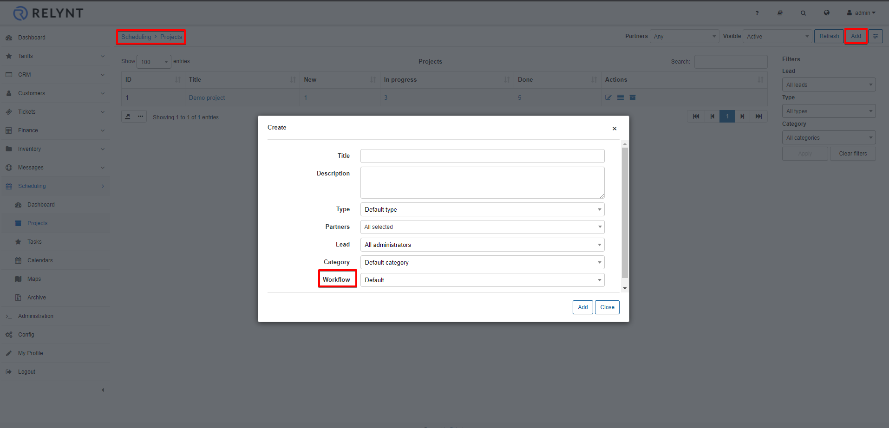
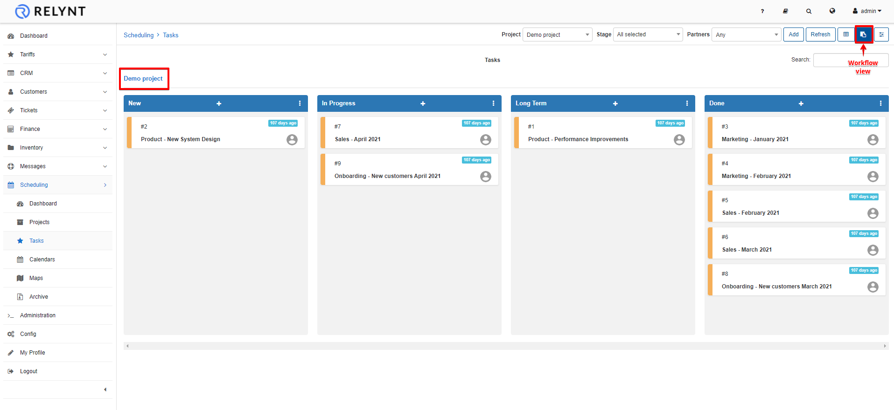

Workflows
=============
In this section new workflows can be added, changed or deleted.

Workflows can be used to track the progress of tasks within a project and also as a form of categorizing the stage of the status of tasks.

There are 3 main statuses/stages to categorize all custom statuses. ***New, In progress and Done***

Workflows can be created and customized as per requirements for the process of projects.

To add a new workflow, simply click on the *Add/+* button at the top of the table:

* **Title** - specify a name for the workflow

* **Status** - specify a name for the custom status within each stage. You can add multiple statuses for each stage and also specify a number of days the status is due for. The due days determines how long the task can stay in this status.  **Please note that status names must be unique in the entire workflow.**

Once new workflows have been added, it can be used when creating or editing projects.

For more information on creating projects click [here](scheduling/projects/projects.md)

Once the workflow is selected for a project we can view the status of all tasks for a project by navigating to the project and selecting the workflow view

