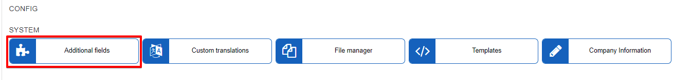
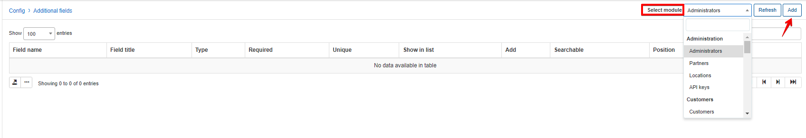
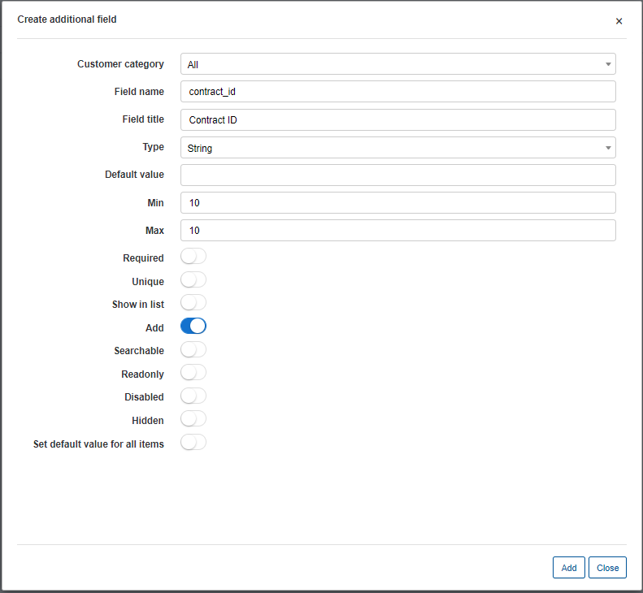
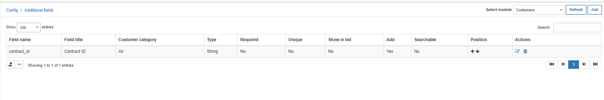
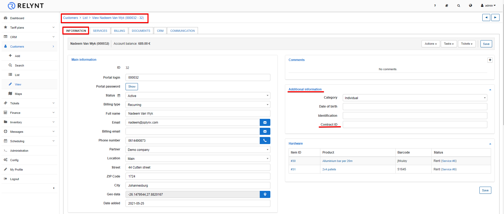
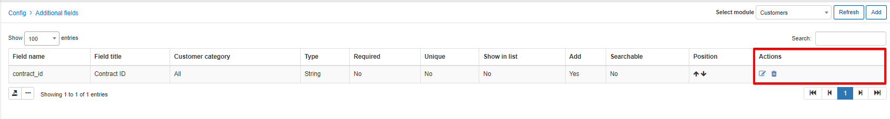

Additional fields
================

In this section we can add fields to the system that is not provided by default. Fields can be added to each available module and designed to work for the specific purpose you may have within the capabilities of the system.

You can add additional custom fields to all of the following modules in Relynt:

### Administration
* Administrators
* Partners
* Location
* API keys

### Customers
* Customers
* Recurring Services
* Customer documents

### Tariff Plans
* Recurring tariffs
* One-time services

### Finance
* Costs
* Invoices
* Transactions
* Payments
* Proforma Invoices

### Inventory

* items
* Supplier Invoices
* Products
* Suppliers
* Vendors

Support
* Tickets
* Messages

### Portal
* News

### Cards
* Refill Cards

### Scheduling
* Projects
* Tasks

### Leads
* Leads

### Quotes
* Quotes
---------

## Adding a new additional/custom field:

The first step is to select which module you would like to add an additional field to, you can select the module in the field provided at the top-right corner of the page.

Thereafter, simply click on the *Add* button to add a new field to the module selected:

A window will appear where you can create the additional field. In this example, a "Contract ID" field is created as an additional field for the Customers module.

* **Customer category** - specify which type of customers this field will be available to, options are *All, Individual or Business only*. (***This field only applies to additional fields for the customer module***)
* **Field name** - specify a name for the field for the system to recognize it in the database.
* **Field title** - specify the common name of the field on the system interface.
* **Type** - specify the type/format of data to be used as values for this field.
* **Default value** - specify a default value to be used as a prefix for the data entered in this field._(optional/have to enable "Set default value for all items")_
* **Required** - enabling this option makes this field mandatory to complete/specify/select.
* **Unique** -  enabling this option requires a unique value to be filled in for this field for all customers.
* **Show in the list** - enables the field to be displayed automatically in the list/table of the selected module as a column.
* **Add** - this option enables/disables the field as a field to fill in within the selected module when adding a new item to the module.(in this example, this option enables/disables the "Contract ID" field, when adding a new customer)
* **Searchable** - enabling/disabling this option states whether items in the selected module can be search for by the values of this field(in this example, this option enables or disables the ability to search for customers by their "Contract id").
* **Set default value for** - this option enables/disables the use of the default value specified in the **Default value** field as the prefix for the value. This option is convenient for fields that consists of values that begin with the same data/number/letters etc. (in this example, this field would add the value specified in the **Default value** as the beginning of the "Contract ID" or the ID itself if it is not modified).

Simply specify the parameters as required and click on add.

The new created field will be displayed in the Additional Fields table and in the Customer Information view:

You can edit or delete a new additional field by clicking on the Edit icon   or the Delete icon   in the *Action* column of the table.

