Custom translations
===================

Custom translations enables you to make your own translations of the Relynt system. This will alter the fields available for you on the admin portal, and your customers in the Customer Portal.

 Custom translation can be done in any language. To add custom translations navigate to `Config → System → Custom translations`.

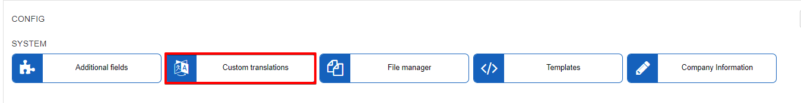

Select a language to translate.

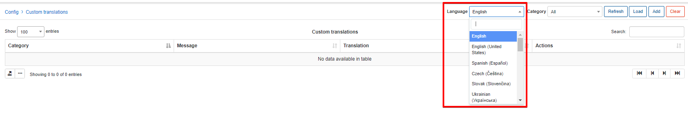

There are two ways of translating: by key words and by categories.

### Translation by key words.

To add a translation select a language first, then click on the *Add* button at the top-right corner of the page. The window will appear where you can type a key word to search for in the "Message" field. This word will appear in all categories it's been used.

1. Select a language to translate.

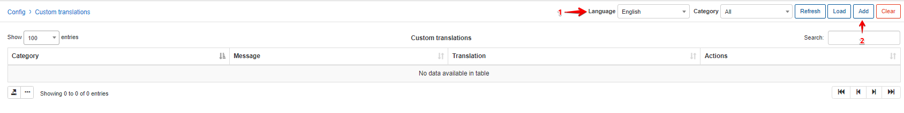

2. Upon clicking on the *Add* button, type the key word to search for in the *Message* field on the Add custom translation page:

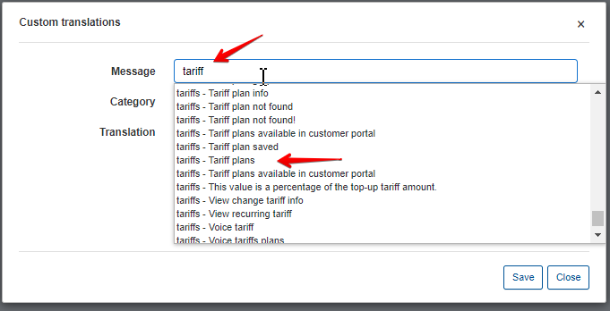

Select the word from the particular category to translate, then simply type the new meaning in the "Translation" field and save it.

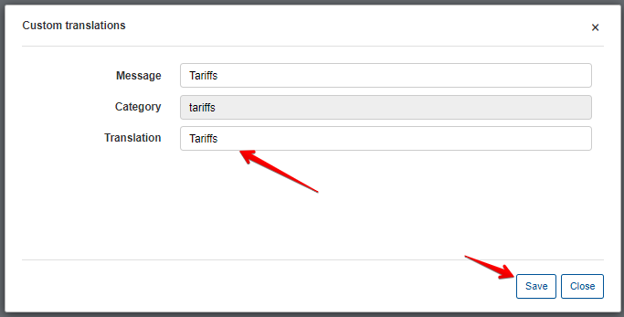

After saving the new translated word, it will appear in the "Custom translations" table.

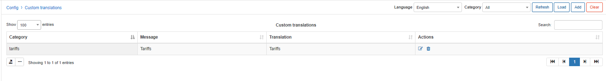

### Translation by categories.

To add a translation select a language, select a category, then click on Load 

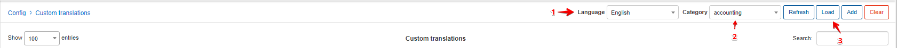

The window will appear to select a category with a warning that all existing translations in the selected category will be overwritten.

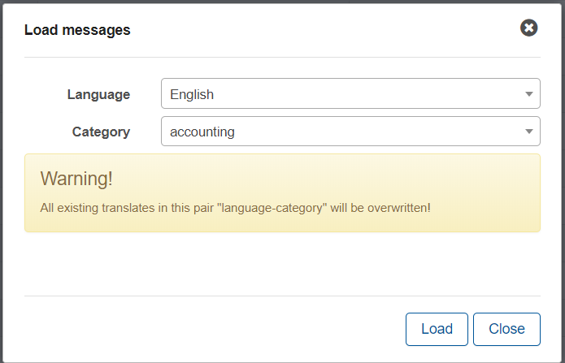

Click on "Load" to see a list of all translations in that particular category.

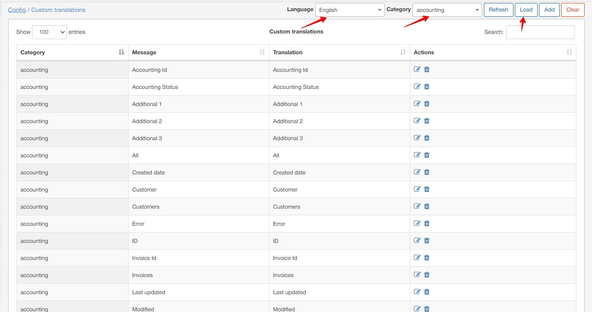

To change or edit a translation, simply click on the Edit icon  in Actions column of the table and type the preferred/new meaning into the *Translation* field.

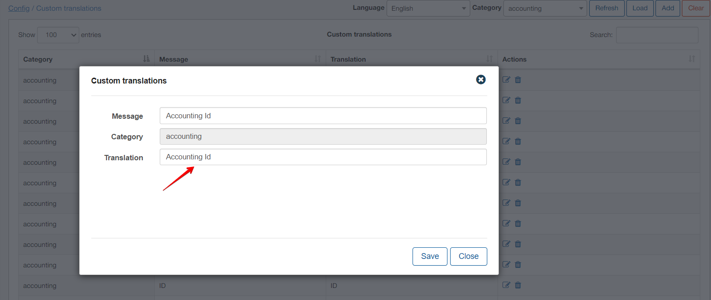

You can also use the Search option to find a particular word in that category. For example, if we will look for a word "Invoice" in Administration category after loading the translation of the category, the system will give us results matching the search criteria:

**Step 1** - select the language and category, then load the translations:

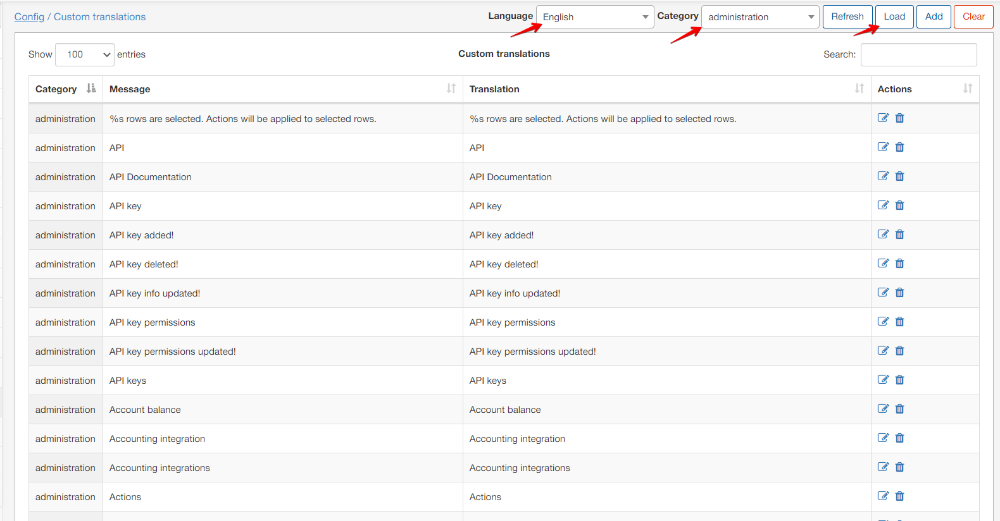

**Step 2** - type the desired word to search for and the results matching or containing  the word will appear:

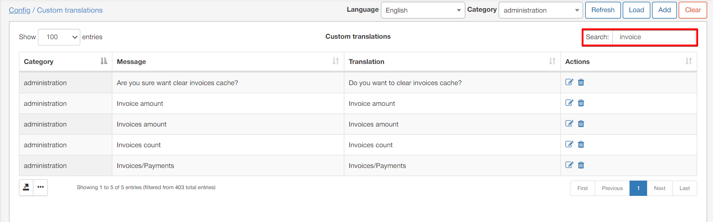

You can then change or edit a desired translation by clicking on the Edit icon  in *Actions* column of the table and type the correct/desired meaning into the *Translation* field.

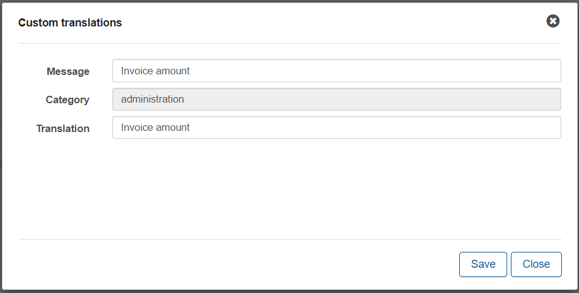
