File manager
===========

File manager in `Config → System` can be used mainly for adding an image files in templates and also for adding/changing the logo for the Admin page or Customer portal of Relynt.

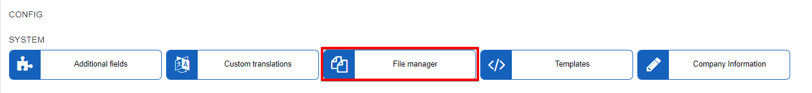

### How to change the logo on your Relynt server via File manager.

First, upload your Logo (image file) onto Relynt via the admin panel in `Config → System → File Manager`.

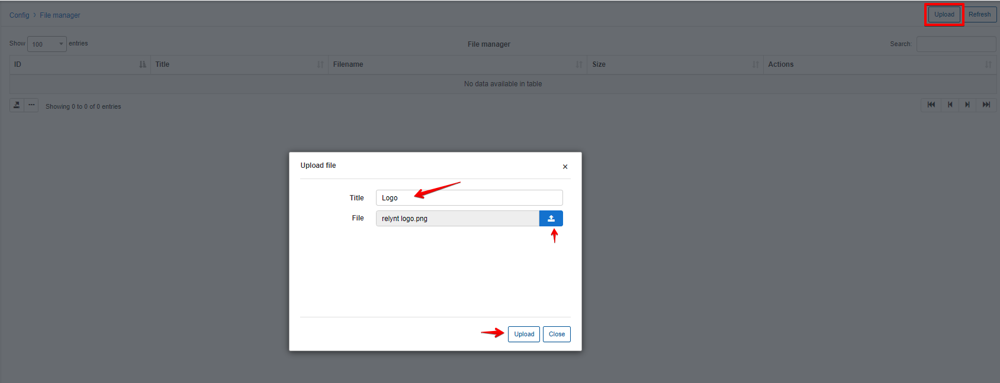

The uploaded file will appear in the list of files in the File manager table.

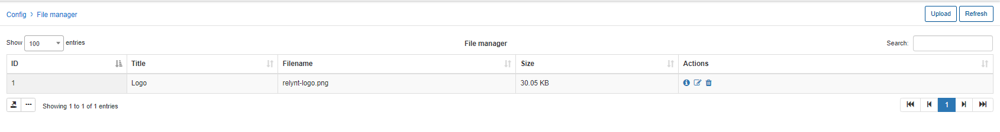

You can edit or delete the file by clicking on either of the icons  or  in the Actions column of the table.

The second step is to copy the Public link of the uploaded file by clicking on the Info icon  in the Actions column of the table.

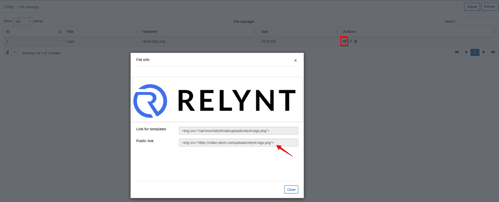

Thereafter, navigate to `Config → Main → Preferences` and insert/paste the link into the Administration portal logo field or Customers portal logo field, depending on the page logo you wish to change.

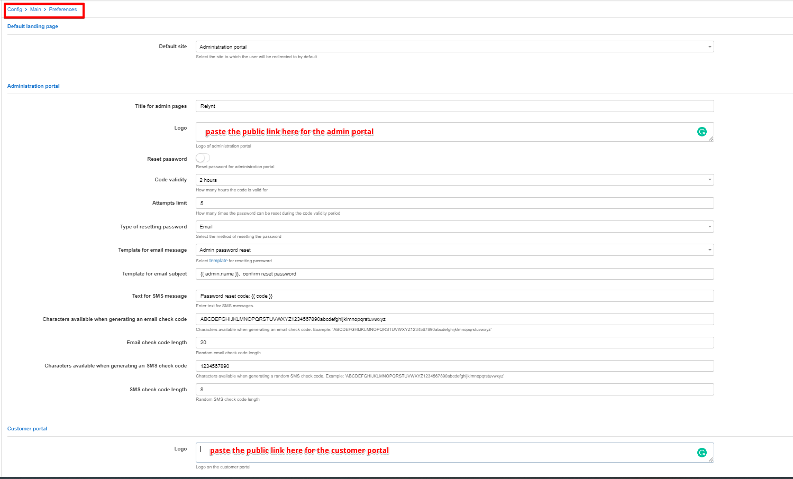

Save the changes, refresh the page and the new logo will appear.

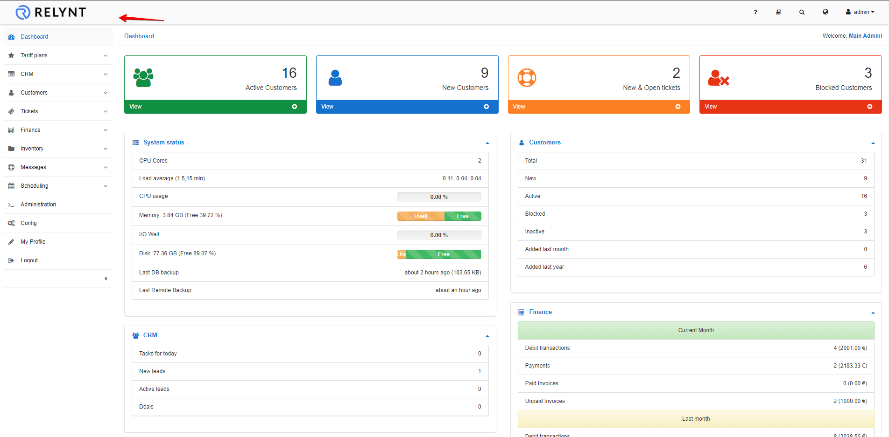

### How to add an image file to templates.

You can add an image to your templates on the system.

*Please note that when adding image files to internal templates you will have to copy the **Link for templates** and for adding the image to external templates (e.g. Customer portal template), you have to copy the **Public link**.*

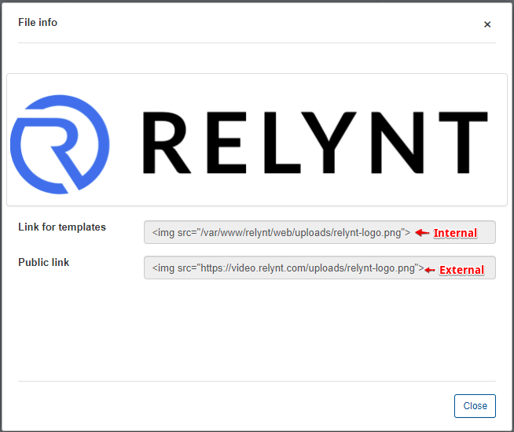

In our example we'll be editing an external template, therefore, we'll use the public link of the image.

* First of all upload your Logo (image file) onto Relynt via the admin panel  `Config → System → File Manager`.
* Copy the Public link by clicking on the Info icon  in the Actions column of the table.

Thereafter, navigate to `Config → System → Templates` and select the template you'd like to add the image/logo to.

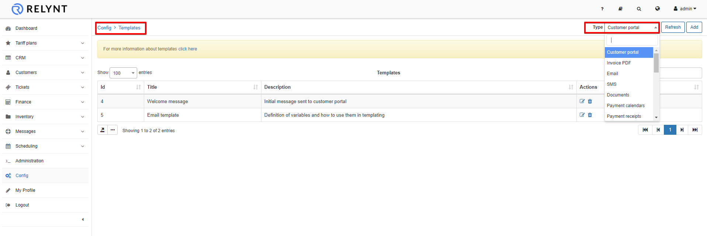

Click on the Edit icon  and insert the link into the code of the message in the position you would like the image/logo to appear.

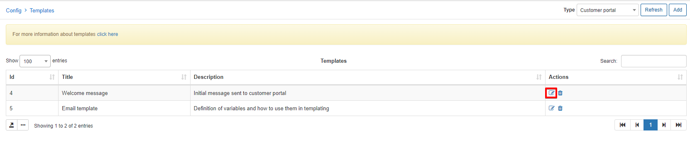
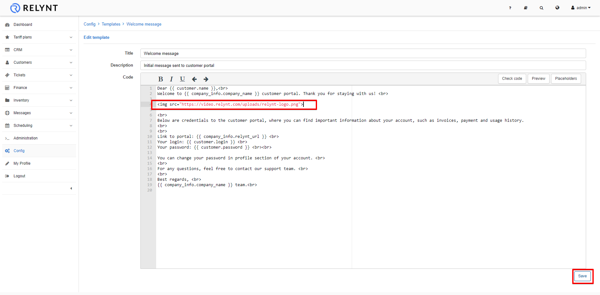

To test the functionality or view the result of what the template will generate, navigate to ` Messages → Mass sending → Create` to send a message to the customer: select a customer and the option to Send the message to the Customer portal or Email,  load the "Welcome message" or the relevant template from the list of templates and send it.

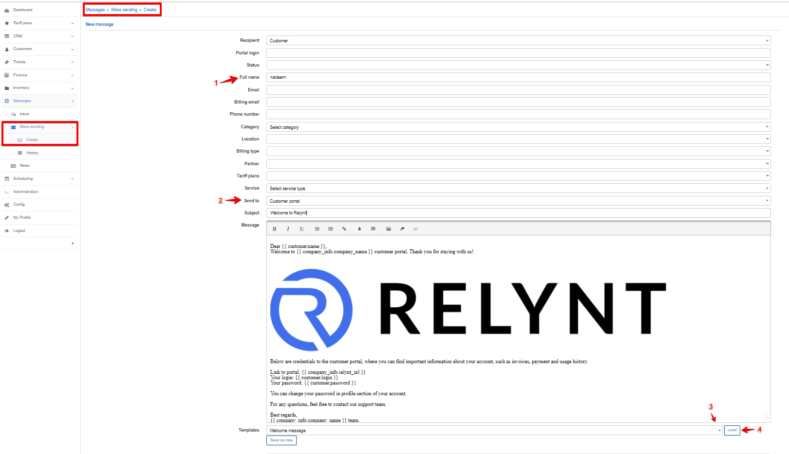

In the Customer portal, the customer will see the message you have composed in the template, as per our example the customer will see the following message:

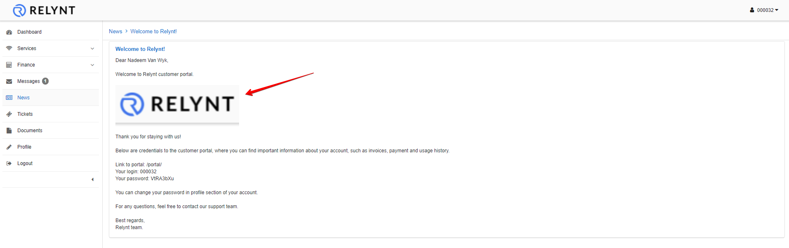
