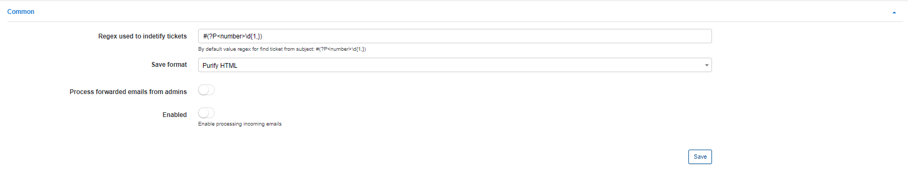
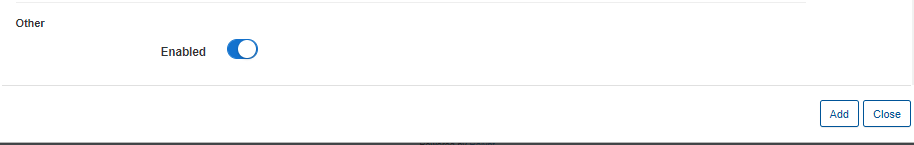

Inboxes
=============

In this section, settings of inboxes(incoming email) can be configured. When a customer sends a message to the email address of one of the inboxes from a registered/recorded email address on their profile - a ticket will be created in Relynt.

This feature was developed for faster communication with in-house support by sending email messages to the support email address instead of logging into the customer portal to create a ticket.

## COMMON

**Regex used to identify tickets** - value used to identify tickets on the system to pair email responses in the relevant ticket. ***This value which should be left to default setting, if you wish to change this parameter please contact Relynt support for assistance first***;

**Save format** - default and only setting available is "Purify HTML";

**Process forwarded emails from admins** - create tickets from administrators emails;

**Enabled** - this is the global enable/disabled option. Even if there are 5 inboxes with an "Enabled" status, if this option is set to disabled, tickets will not be created.

## INCOMING INBOXES

New inboxes can be added, removed or changed here.

We can create an inbox by simply clicking on the `"+"` icon on the top left of the table:

### Credentials

You can use your own email account in this with your own domain/incoming server settings.

As an example, we are going to create a new inbox using a gmail email address. IMAP details for gmail can be found on the following page:
 https://support.google.com/mail/answer/7126229?hl=en

 

 * **Email** - specify the email address for the inbox customers will send emails to

 * **Username** - specify the authenticating username for the email account.

 * **Password** - specify the authenticating password for the email account

 * **Host** - specify the incoming email server address

 * **Port** - specify the port used by the host for incoming email, this will be determined by the incoming protocol you will use/is available for incoming email.

 * **No valid certificate** - enables/disables validation of host server certificates

When all the credentials have been added, click on "Test connection" to run a test to ensure that the inbox is connected to the gmail account.

If the test runs successfully or unsuccessfully you will see a result below the Test connection button:

### IMAP settings:

In this section we can configure processing parameters for the email account connected.

  * **Which messages to process:** select which email message to process as tickets on the system, options are "All" or "Unread";

  * **Process from date/time** -  specify the date and time to start email processing for the email account. For example, if you select the date as 2020-01-01 00:00:00, Relynt will try to process all emails from this date and create tickets from all these emails;

  * **Mark as read** - mark emails as read in the inbox if it was successfully processed on the system;

  * **Use address from header** - Option are: "From", "Reply to" or "Sender" - means use the address from one of these available fields as the header.

### Ticket creating:

In this section we can configure parameters for creating tickets on the system for the emails sent to the account configured.

  * **Receive unregistered emails** - this means, if this option is enabled, tickets will be created from all emails, even if the email address isn't registered to an existing customer in Relynt. If disabled, only emails sent by registered customer email addresses will create tickets from the inbox;

  * **Priority** - select a default priority for ticket new tickets;

  * **Group** - select a default group to assign new tickets to, should be specifically used when multiple inboxes are configured;

  * **Type** - select a default type for new tickets;

### Other

This option is simply used to enable or disable creating tickets for emails from the current inbox on the system.

## Deny list

Email addresses you wish to ignore can be added here. Emails from these email addresses will not be create tickets on the system.

---

Multiple inboxes can be created on the system to accommodate an automated, separated support department. For example, separate inboxes can be set up for your finance, sales and technical departments. This will require you to create ticket groups where you can assign the relevant staff members to each group, and assign the relevant inboxes to each corresponding group.

Ticket groups can be configured in [Miscellaneous ticket configuration](configuration/tickets/miscellaneous_ticket_configuration/miscellaneous_ticket_configuration.md).
