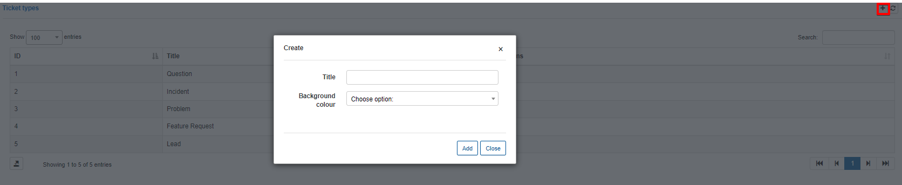

Miscellaneous ticket configuration
=============

In this section general values used for tickets can be customized.

We can add/remove or customize parameters of ticket statuses, ticket types, and ticket groups can be here.

## TICKET STATUSES

This is a list of default ticket statuses in Relynt, you can edit or remove these and add new statuses with the use of `+` at the top right of the table.

In some cases additional statuses are needed to accommodate processes of your support department. For example, if a support agent is not able to resolve the issue via email communication, a telephonic or video call maybe necessary to assist a customer, in this case we can create a status "Call scheduled" which will mean that an admin/agent has arranged the call with the customer.

* **Title for agent** - specify the description of the status to the assigned admin/group, this is what will be displayed as the status of the ticket on the admin panel.

* **Title for customer** - specify the description of the status to the customer, this is what will be displayed as the status of the ticket on customer portal.

* **Label** - select the condition of the ticket, labels defines the state of the ticket, which will determine how the ticket will be classified, grouped and automation conditions within the system. For example "warning" will indicate that the ticket is awaiting a response from the customer and all automation set for conditions relating to customers will be applied to the ticket.

* **Mark** - select the mark tickets set to this status will be set to or can be set to, options are "All, Open, Unresolved, or Closed"

* **View on dashboard** -  enable/disable displaying this status on the dashboard

* **Icon on dashboard** - specify code for a customized icon which will displayed on the dashboard for tickets set to this status

Special icons can be added if needed. You can use icon codes from the following page:
https://fontawesome.com/v4.7.0/icons/

Once ticket status is created it can be used when creating new tickets or in the configuration of tickets.

## TICKET TYPES

Ticket types are used to describe the nature of a ticket. For example, it could be an Incident, question, problem or a feature request, etc. You can also configure ticket types to separate which department it is directed to. For example, support, accounts, sales, etc.

To add a new ticket type, simply click on the `"+"` icon at the tope right of the table.

* **Title** - specify a descriptive title for the ticket type.

* **Background colour** - select a clolour to highlight tickets created with this type(optional)

Once ticket types is created it can be used when creating new tickets or in the configuration of tickets.

## TICKET GROUPS

Ticket groups are used when your system is configured to assign tickets to specific groups(teams).

To edit a ticket group click on the `"Edit"` button of the group. Here you can select the admins who are in this group and create a relevant description.

***Please Note!*** - When assigning admins to groups, it is necessary for the admin to first have their **Helpdesk scope** configured as Group and that the necessary group is selected:

Once admins are assigned to a group, their helpdesk scope will be changed accordingly, for example, if you have assigned the group scope and made all groups available for an admin, once he is assign to a group, the scope groups will be change to only the selected group.

Helpdesk Scopes influence how admins can and are interacted with in the ticket module.

Scopes can be configured in [Administrators](administration/main/admins_and_permissions/admins_and_permissions.md) under Administration.
